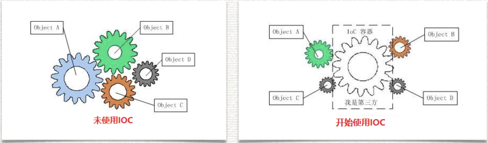

编程思想的逐层提升

**1. 面向对象**

传统的方式是动态的引入需要的类

**2. 工厂模式**

业务层不需要关注实例到底怎么生成的

**3. 面向切面**

不用再写工厂类， 直接从 IOC 容器中创建好的实例取

:bell: **OOP 是静态的抽象，AOP 是动态的抽象。**

## SOLID 设计原则

SOLID 是由罗伯特·C·⻢丁在21世纪早期引入的记忆术首字母缩略字，指代了**面向对象编程和面向对象设计的五个基本原则**。当这些原则被一起应用时，它们使得一个程序员开发一个容易进行软件维护和扩展的系统变得更加可能，SOLID 被典型的应用在测试驱动开发上，并且是敏捷开发以及自适应软件开发的基本原则的重要组成部分。

这五个基本原则分别是：

- 单一功能原则（Single Responsibility Principle）

- 开闭原则（Open Close Principle）

- 里氏替换原则（Liskov Substitution Principle）

- 接口隔离原则（Interface Segregation Principle）

- 依赖反转原则（Dependence Inversion Principle）

### 单一功能原则

- 单一功能原则认为对象应该仅具有一种单一功能。

- 换句话说就是**让一个类只做一种类型责任，当这个类需要承担其他类型的责任的时候，就需要分解这个类**。在所有的SOLID原则中，这是大多数开发人员感到最能完全理解的一条。严格来说，这也可能是违反最频繁的一条原则了。

- 单一责任原则可以看作是**低耦合、高内聚**在面向对象原则上的引申，将责任定义为引起变化的原因，以提高内聚性来减少引起变化的原因。责任过多，可能引起它变化的原因就越多，这将导致责任依赖，相互之间就产生影响，从而极大的损伤其内聚性和耦合度。

- 单一责任，通常意味着单一的功能，因此不要为一个模块实 现过多的功能点，以保证实体只有一个引起它变化的原因。

- C# 代码示例

```C
namespace SOLID
{
    public class Users
    {
        /// <summary>
        /// 支付
        /// </summary>
        public void Pay(){}

        /// <summary>
        /// 数据库操作
        /// </summary>
        public void DataAccess(){}

        /// <summary>
        /// 日志操作
        /// </summary>
        public void Logger(){}
    }
}
//1.在这个用户类中有这三个功能：1.支付逻辑，2数据库逻辑，3.日志操作。
//2.如果将这三个功能结合在一个类中，可能会出现修改部分代码时会破坏其他的部分。
//3.多个功能也使这个用户类难以理解，降低了内聚性。所以最好就是将这个类分离为三个分离的类，每个类仅仅有一个功能。
namespace SOLID
{
    /// <summary>
    /// 数据库操作
    /// </summary>
    class DataAccess { }

    /// <summary>
    /// 日志
    /// </summary>
    class Logger { }

    /// <summary>
    /// 支付
    /// </summary>
    class Pay { }
}
```

### 开闭原则

- 开闭原则(ocp) 认为“软件体应该是对于扩展开放的，但是对于修改封闭的”。

- 软件实体应该是可扩展，而不可修改的。也就是说，**对扩展是开放的，而对修改是封闭的(“开”指的就是类、模块、函数都应该具有可扩展性，“闭”指的是它们不应该被修 改。也就是说你可以新增功能但不能去修改源码)**。

- 这个原则是诸多面向对象编程原则中最抽象、最难理解的一个。

- 对扩展开放，意味着有新的需求或变化时，可以对现有代码进行扩展，以适应新的情况。对修改封闭，意味着类一旦设计完成，就可以独立完成其工作，而不要对类进行任 何修改。

- 可以使用变化和不变来说明：封装不变部分，开放变化部分，一般使用接口继承实现方式来实现“开放”应对变化，说大白话就是：你不是要变化吗?，那么我就让你继承实现一个对象，用一个接口来抽象你的职责，你变化越多，继承实现的子类就越多。

- C# 代码示例

```C
//abstract修饰的类，叫做抽象类，是不允许实例化的类，
//不能直接创建对象，必须要通过子类创建才能使用abstract类的方法。
abstract class DataAccess
{
    public abstract void OpenConnection();
    public abstract void CloseConnection();
    public abstract void ExecuteCommand();
}

/// <summary>
/// SQL
/// </summary>
class SqlDataAccess : DataAccess
{
    /// <summary>
    /// 打开SQL数据库
    /// </summary>
    public override void OpenConnection() { }
    /// <summary>
    /// 关闭Sql数据连接
    /// </summary>
    public override void CloseConnection() { }
    /// <summary>
    /// 执行Sql数据命令
    /// </summary>
    public override void ExecuteCommand() { }
}

/// <summary>
/// ORACLE
/// </summary>
class OracleDataAccess : DataAccess
{
    /// <summary>
    /// 打开Oracle数据连接
    /// </summary>
    public override void OpenConnection() { }
    /// <summary>
    /// 关闭Oracle数据连接
    /// </summary>
    public override void CloseConnection() { }
    /// <summary>
    /// 执行Oracle数据命令
    /// </summary>
    public override void ExecuteCommand() { }
}
```

### 里氏替换原则

- 里氏替换原则认为“**程序中的对象应该是可以在不改变程序正确性的前提下被它的子类所替换的**”。

- **子类必须能够替换成它们的基类**。即：子类应该可以替换任何基类能够出现的地方，并且经过替换以后，代码还能正常工作。

- 另外，不应该在代码中出现 if/else 之类对子类类型进行判断的条件。

- 里氏替换原则 LSP 是使代码符合开闭原则的一个重要保证。正是由于子类型的可替换性才使得父类型的模块在无需修改的情况下就可以扩展。

- 在很多情况下，在设计初期我们类之间的关系不是很明确，LSP 则给了我们一个判断和设计类之间关系的基准：需不需要继承，以及怎样设计继承关系。

- 当一个子类的实例应该能够替换任何其超类的实例时，它们之间才具有 is-A 关系。继承对于 OCP，就相当于多态性对于里氏替换原则。子类可以代替基类，客户使用基类，它们不需要知道派生类所做的事情。这是一个针对行为职责可替代的原则，如果 S 是 T 的子类型，那么 S 对象就应该在不改变任何抽象属性情况下替换所有 T 对象。

- C# 代码示例

```C
class Rectangle
{
    protected int width = 0;
    protected int height = 0;
    public virtual void SetWidth(int width)
    {
        this.width = width;
    }
    public virtual void SetHeight(int height)
    {
        this.height = height;
    }
    public virtual int GetArea()
    {
        return this.width * this.height;
    }
}
class Square : Rectangle
{
    public override void SetHeight(int height)
    {
        this.height = height;
        this.width = height;
    }
    public override void SetWidth(int width)
    {
        this.height = width;
        this.width = width;
    }
}
```

### 接口隔离原则

- 接口隔离原则认为“**多个特定客户端接口要好于一个宽泛用途的接口**”。

- 不能强迫用户去依赖那些他们不使用的接口。换句话说，**使用多个专⻔的接口比使用单一的总接口总要好**(JavaScript 几乎没有接口的概念所以使用 ts)。

- 注意：在代码中应用 ISP 并不一定意味着服务 就是绝对安全的。仍然需要采用良好的编码实践，以确保正确的验证与授权。

- 这个原则起源于施乐公司，他们需要建立了一个新的打印机系统，可以执行诸如装订的印刷品一套，传真多种任务。此系统软件创建从底层开始编制，并实现了这些任务功能，但是不断增⻓的软件功能却使软件本身越来越难适应变化和维护。每一次改变，即使是最小的变化，有人可能需要近一个小时的重新编译和重新部署。这是几乎不可能再继续发展，所以他们聘请罗伯特 Robert 帮助他们。他们首先设计了一个主要类 Job，几乎能够用于实现所有任务功能。只要调用 Job 类的一个方法就可以实现一个功能，Job 类就变动非常大，是一个胖模型啊，对于客户端如果只需要一个打印功能，但是其他无关打印的方法功能也和其耦合，ISP 原则建议在客户端和 Job 类之间增加一个接口层，对于不同功能有不同接口，比如打印功能就是 Print 接口，然后将大的 Job 类切分为继承不同接口的子类，这样有一个 Print Job 类等等。

- C# 代码示例

```C
interface IDataAccess
{
    void OpenConnection();
    void CloseConnection();
}

interface ISqlDataAccess : IDataAccess
{
    void ExecuteSqlCommand();
}
interface IOracleDataAccess : IDataAccess
{
    void ExecuteOracleCommand();
}
class SqlDataAccess : ISqlDataAccess
{
    /// <summary>
    /// 执行Sql数据命令
    /// </summary>
    public void ExecuteSqlCommand(){}

    /// <summary>
    /// 打开Sql数据连接
    /// </summary>
    public void OpenConnection(){}

    /// <summary>
    /// 关闭Sql数据连接
    /// </summary>
    public void CloseConnection(){}
}
class OracleDataAccess : IOracleDataAccess
{
    /// <summary>
    /// 执行Oracle数据命令
    /// </summary>
    public void ExecuteOracleCommand(){}

    /// <summary>
    /// 打开Oracle数据连接
    /// </summary>
    public void OpenConnection(){}

    /// <summary>
    /// 关闭Oracle数据连接
    /// </summary>
    public void CloseConnection(){}
}
```

### 依赖反转原则

- 依赖倒置原则(Dependency Inversion Principle，DIP)规定：**代码应当取决于抽象概念，而不是具体实现**。

- **高层模块不应该依赖于低层模块，二者都应该依赖于抽象**。

- **抽象不应该依赖于细节，细节应该依赖于抽象 (总结解耦)**。

- 类可能依赖于其他类来执行其工作。但是，它们不应当依赖于该类的特定具体实现，而应当是它的抽象。这个原则实在是太重要了，社会的分工化，标准化都是这个设计原则的体现。

- 显然，这一概念会大大提高系统的灵活性。如果类只关心它们用于支持特定契约而不是特定类型的组件，就可以快速而轻松地修改这些低级服务的功能，同时最大限度地降低对系统其余部分的影响。

- C# 示例代码

```C
    interface IBankAccount
    {
        long BankNumber { get; set; } // 卡号
        decimal Balance { get; set; } // 余额
    }

    // 转账人
    interface ITransferSource : IBankAccount
    {
        void CutPayment(decimal value);
    }

    // 收款人
    interface ITransferDestination : IBankAccount
    {
        void AddMoney(decimal value);
    }

    class BankAccout : IBankAccount, ITransferSource, ITransferDestination
    {
        public long BankNumber { get; set; }
        public decimal Balance { get; set; }
        public void CutPayment(decimal value)
        {
            Balance -= value;
        }
        public void AddMoney(decimal value)
        {
            Balance += value;
        }
    }
   
    class TransferAmount
    {
        public decimal Amount { get; set; }
        public void Transfer(ITransferSource source, ITransferDestination dest)
        {
            source.CutPayment(Amount);
            dest.AddMoney(Amount);
        }
    }
```

## 依赖注入 DI

### 什么是依赖注入？

当某个⻆色要另一个⻆色协助时，通常由调用者来创建被调用者的实例。现在创建实例由容器来完成然后注入调用者。

### 注入过程

如果需要调用另一个对象协助时，无须在代码中创建被调用者，而是依赖外部的注入。

### 两种注入方式

设值注入、构造注入。

## 控制反转 IoC

### 什么是控制反转？

控制反转(Inversion of Control，缩写为 IoC)，是面向对象编程中的一种设计原则，**可以用来减低计算机代码之间的耦合度**。其中最常⻅的方式叫做**依赖注入(Dependency Injection，简称 DI)**，还有一种方式叫**依赖查找(Dependency Lookup)**。通过控制反转，对象在被创建的时候，由一个调控系统内所有对象的外界实体，将其所依赖的对象的引用传递给它。也可以说，依赖被注入到对象中。

### 控制反转的两种方式

- 依赖查找: 容器提供回调接口和上下文条件给组件。

- 依赖注入: 组件不做定位查询，只提供普通的方法让容器去决定依赖关系。



### C# 代码示例

```C
//IoC容器，它就是一个创建工厂，你要什么对象，它就给你什么对象，有了IoC容器，依赖关系就变了，
//原先的依赖关系就没了，它们都依赖IoC容器了，通过IoC容器来建立它们之间的关系。
//通过反射来创建，把具体的文件名写在配置文件里，这时候客户端代码也不用变了，只需要改配置文件就好了，稳定性又有了提高，如下：

public class MediaFile {
    public void PlayMedia() {
        IMediaFile _mtype = Assembly.Load(ConfigurationManager.AppSettings["AssemName"]).CreateInstance(ConfigurationManager.AppSettings["MediaName"]);
        IPlayer _player = Assembly.Load(ConfigurationManager.AppSettings["AssemName"]).CreateInstance(ConfigurationManager.AppSettings["PlayerName"]);
        _player.Play(_mtype);
    }
}
```

## 面向切面编程 AOP

### 什么是面向切面编程？

- 在软件业，AOP 为 Aspect Oriented Programming 的缩写，意为面向切面编程，通过**预编译方式**和**运行期动态代理**实现程序功能的统一维护的一种技术。

- AOP 是 OOP 的延续，是软件开发中的一个热点，也是 Spring 框架中的一个重要内容，**是函数式编程的一种衍生范型**。

- 利用 AOP 可以对业务逻辑的各个部分进行隔离，从而使得业务逻辑各部分之间的耦合度降低，提高程序的可重用性，同时提高了开发的效率。

- AOP 完善 Spring 的依赖注入(DI)，面向对象编程将程序分解成各个层次的对象，面向切面编程将程序运行过程分解成各个切面。

### Filter

Filter(过滤器)也是一种 AOPA，它利用一种称为"横切"的技术，剖解开封装的对象内部，并将那些影响了多个类的公共行为封装到一个可重用模块，并将其命名为"Aspect"，即切面。所谓"切面"。

### 优点

AOP 的好处就是你只需要干你的正事，其它事情别人帮你干。在你访问数据库之前，自动帮你开启事务，当你访问数据库结束之后，自动帮你提交/回滚事务。