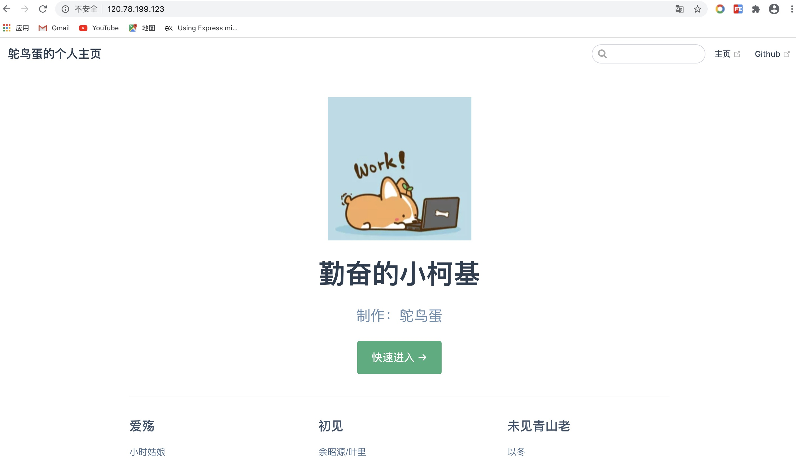

## 搭建方法

[VuePress搭建技术网站与个人博客](https://mp.weixin.qq.com/s/TR8TS-teKhCbGKtjNqMqWQ)

## 碰到的问题

1. 部署代码的时候执行命令`npm run deploy`，这句脚本实际上执行的是`bash deploy.sh`，但是在windows系统上是不能直接运行bash命令的，所以需要在git bash里面运行。

  

2. 提交代码的过程中会遇到没有权限提交到github仓库的问题，此时我们需要在本地配置并创建ssh key。方法如下：  

  （1）在git bash中执行命令： 

  ```bash
  ssh-keygen -t rsa -C "your_email@email.com"
  ```

  （2）回车后可以输入本地保存ssh key的地址，括号里有一个默认地址，当然也可以直接使用这个地址，直接回车就行了。然后再设置密码，ssh key就生成好了。

  （3）找到本地存放ssh key的文件夹，打开带有P标识的文件，复制里面的ssh key。

  

  （4）访问自己的github，找到 SSH and GPG keys，将刚刚复制的ssh key放到这里就行了。

    
  
  此时，再去向远程仓库拉取或者提交代码就没问题了。

  （5）Mac 电脑生成的 ssh key 存放在以下路径中。

  ```
  /var/root/.ssh/id_rsa.pub
  ```

## 部署到服务器上

1. 首先，服务器上需要安装配置好 nginx，安装方法可以查看 [Nginx 安装](../nginx/install.md)。

2. 然后，进入到项目目录中，执行 `npm run build` 命令打包项目。

3. 其次，将打包生成的 dist 目录上传到服务器上的 `/etc/nginx` 目录下。

```shell
scp -r dist scl:/etc/nginx
```

4. 最后，修改 nginx 的配置文件中的 root，把它改成访问项目的首页。

```
root /etc/nginx/dist;
```

此时，在浏览器中访问服务器 IP 地址，就可以看到自己的博客啦～:smile:



## 使用 Jenkins 自动构建部署

[Jenkins 构建部署](../../engineering/jenkins.md#新建-jenkins-任务)

::: tip 补充
[VuePress中文文档](https://vuepress.vuejs.org/zh/)  
[Markdown语法详解](https://github.com/cdoco/markdown-syntax)
:::