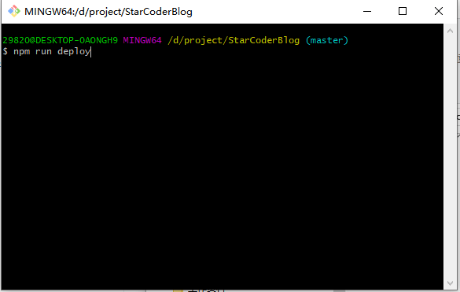
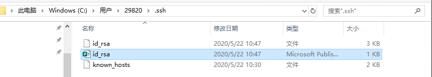
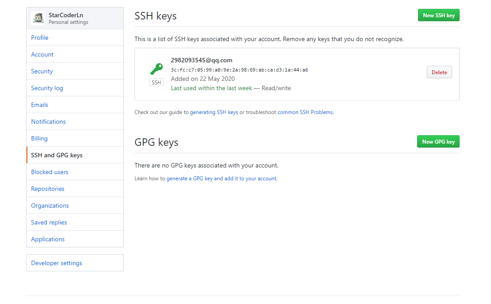

## 如何搭建个人博客

1. 具体搭建方法可以参考这篇文章：  
[VuePress搭建技术网站与个人博客](https://mp.weixin.qq.com/s/TR8TS-teKhCbGKtjNqMqWQ)

2. 在搭建过程中，我碰到了两点需要注意的问题：
- 部署代码的时候执行命令`npm run deploy`，这句脚本实际上执行的是`bash deploy.sh`，但是在windows系统上是不能直接运行bash命令的，所以需要在git bash里面运行。



- 提交代码的过程中会遇到没有权限提交到github仓库的问题，此时我们需要在本地配置并创建ssh key。方法如下：  
  （1）在git bash中执行命令：  
  ```bash
  ssh-keygen -t rsa -C "your_email@email.com"
  ```
  （2）回车后可以输入本地保存ssh key的地址，括号里有一个默认地址，当然也可以直接使用这个地址，直接回车就行了。然后再设置密码，ssh key就生成好了。  
  （3）找到本地存放ssh key的文件夹，打开带有P标识的文件，复制里面的ssh key。

  

  （4）访问自己的github，找到 SSH and GPG keys，将刚刚复制的ssh key放到这里就行了。

    
  
  此时，再去向远程仓库拉取或者提交代码就没问题了。

3. 补充  
[VuePress中文文档](https://vuepress.vuejs.org/zh/)  
[Markdown语法详解](https://github.com/cdoco/markdown-syntax)