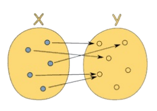
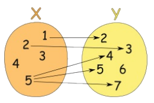

原书：[《看完就够用的函数式编程》](https://llh911001.gitbooks.io/mostly-adequate-guide-chinese/)

以下内容是我在阅读这本书时抽取整理的一些个人觉得有帮助的东西，相当于对书中内容做一个简化，方便自己学习理解。

## 引入函数式编程

从一个简单的例子开始说起。下面是一个海鸥程序，鸟群合并`conjoin`则变成了一个更大的鸟群，繁殖`breed`则增加了鸟群的数量，增加的数量就是它们繁殖出来的海鸥的数量。

```js
var Flock = function (n) {
  this.seagulls = n;
};
Flock.prototype.conjoin = function (other) {
  this.seagulls += other.seagulls;
  return this;
};
Flock.prototype.breed = function (other) {
  this.seagulls = this.seagulls * other.seagulls;
  return this;
};
var flock_a = new Flock(4);
var flock_b = new Flock(2);
var flock_c = new Flock(0);
var result = flock_a
  .conjoin(flock_c)
  .breed(flock_b)
  .conjoin(flock_a.breed(flock_b)).seagulls; //=> 32
```

这段代码其实并不好，它使得代码的内部可变状态变得非常难以追踪，而且最终的计算结果是错的，正确的答案应该是 16。这是因为 flock_a 在计算过程中被永久的改变了。

下面试试一种更函数式的写法

```js
var conjoin = function(flock_x, flock_y) {
  return flock_x + flock_y
};
var breed = function(flock_x, flock_y) {
  return flock_x * flock_ y
};
var flock_a = 4;
var flock_b = 2;
var flock_c = 0;
var result = conjoin(breed(flock_b, conjoin(flock_a, flock_c)),
                      breed(flock_a, flock_b)); //=>16
```

这段代码明显比上面的少写了很多，而且答案也是正确的。不过函数的嵌套不太好理解，仔细深究的话，我们会发现它其实是在进行简单的加`conjoin`和乘`breed`运算而已。把代码中的两个函数名换一下

```js
var add = function (x, y) {
  return x + y;
};
var multiply = function (x, y) {
  return x * y;
};
var flock_a = 4;
var flock_b = 2;
var flock_c = 0;
var result = add(
  multiply(flock_b, add(flock_a, flock_c)),
  multiply(flock_a, flock_b)
); //=>16
```

这样一来看着就比较熟悉了。下面是我们很早就学过的一些经典数学定律

```js
// 结合律（assosiative）
add(add(x, y), z) == add(x, add(y, z));

// 交换律（commutative）
add(x, y) == add(y, x);

// 同一律（identity）
add(x, 0) == x;

// 分配律（distributive）
multiply(x, add(y, z)) == add(multiply(x, y), multiply(x, z));
```

我们可以用这些定律继续简化上面的代码

```js
// 原有代码
add(multiply(flock_b, add(flock_a, flock_c)), multiply(flock_a, flock_b));

// 应用同一律，去掉多余的加法操作（add(flock_a, flock_c) == flock_a）
add(multiply(flock_b, flock_a), multiply(flock_a, flock_b));

// 再应用分配律
multiply(flock_b, add(flock_a, flock_a));
```

到这里，代码就变得很简洁明了了。只需要调用函数即可，没有多余的代码。

```js
var add = function (x, y) {
  return x + y;
};
var multiply = function (x, y) {
  return x * y;
};
var flock_a = 4;
var flock_b = 2;
var flock_c = 0;
var result = multiply(flock_b, add(flock_a, flock_a));
```

## 一等公民的函数

**1. 几个简单的例子**

当我们说函数是“一等公民”的时候，其实是说它们跟其他对象都一样，没什么特殊的，我们可以像对待任何其他数据类型一样对待它们——把它们存进数组、当作参数传递、赋值给变量等等。

这是 JavaScript 的基础概念，但是很多人其实会无视它。比如下面的代码

```js
const hi = (name) => `Hi ${name}`;
const greeting = (name) => hi(name);
```

这里 greeting 指向的那个把 hi 包了一层的包裹函数完全是多余的。因为 JavaScript 的函数是可调用的，当 hi 后面紧跟()的时候就会运行并返回一个值；如果没有(), hi 就简单地返回存到这个变量里的函数。

```js
hi; // name => `Hi ${name}`
hi("jonas"); // "Hi jonas"
```

因此上面的代码应该写成下面这样

```js
const greeting = hi;
greeting("times"); // "Hi times"
```

用一个函数把另一个函数包起来，目的仅仅是延迟执行，是一种非常糟糕的编程习惯。充分理解这个问题很重要，下面是几个类似例子

```js
// 太傻了
const getServerStuff = (callback) => ajaxCall((json) => callback(json));
```

上面这句代码可以一步一步转换成下面这样

```js
// 这行
ajaxCall(json => callback(json));

// 等价于这行
ajaxCall(callback);

// 那么，重构下
getServerStuff const getServerStuff = callback => ajaxCall(callback);

// ...就等于
const getServerStuff = ajaxCall // <-- 看，没有括号哦
```

还有下面这个例子

```js
const BlogController = {
  index(posts) {
    return Views.index(posts);
  },
  show(post) {
    return Views.show(post);
  },
  create(attrs) {
    return Db.create(attrs);
  },
  update(post, attrs) {
    return Db.update(post, attrs);
  },
  destroy(post) {
    return Db.destroy(post);
  },
};
```

可以重写成

```js
const BlogController = {
  index: Views.index,
  show: Views.show,
  create: Db.create,
  update: Db.update,
  destroy: Db.destroy,
};
```

以上才是写函数的正确方式。

**2. 为什么要将函数当成一等公民看待**

通过前面的例子可以看到，虽说添加一些没有实际用处的间接层实现起来很容易，但这样做除了徒增代码量，提高维护和检索代码的成本外，没有任何用处。

另外，如果一个函数被不必要地包裹起来了，而且发生了改动，那么包裹它的那个函数也要做相应的变更。

```js
httpGet("/post/2", (json) => renderPost(json));
```

如果 httpGet 要改成可以抛出一个可能出现的 err 异常，那我们还要回过头去把“胶水”函数也改了。

```js
// 把整个应用里的所有 httpGet 调用都改成这样，可以传递 err 参数。
httpGet("/post/2", (json, err) => renderPost(json, err));
```

如果一开始就写成一等公民函数的形式，需要改动的地方将会少得多

```js
httpGet("/post/2", renderPost); // renderPost 将会在 httpGet 中调用，想要多少参数都行
```

除了删除不必要的函数，正确地为参数命名也必不可少。项目中常见的一种造成混淆的原因是，针对同一个概念使用不同的命名。还有通用代码的问题。比如，下面这两个函数做的事情一模一样，但后一个就显得更加通用，可重用性也更高：

```js
// 只针对当前的博客
const validArticles = articles => articles.filter(article => article !== null && article !== undefined),

// 对未来的项目更友好
const compact = xs => xs.filter(x => x !== null && x !== undefined);
```

在命名的时候，我们特别容易把自己限定在特定的数据上（本例中是 articles ）。这种现象很常见，也是重复造轮子的一大原因。

还有一点需要特别注意的是 this 的使用，如果一个底层函数使用了 this ，而且是以一等公民的方式被调用的，可能会有问题。

```js
var fs = require("fs");

// 太可怕了
fs.readFile("freaky_friday.txt", Db.save);

// 好一点点
fs.readFile("freaky_friday.txt", Db.save.bind(Db));
```

把 Db 绑定（bind）到它自己身上以后，就可以随心所欲地调用它的原型链式垃圾代码了。 在函数式编程中，应该尽可能避免使用 this，因为根本用不到它。

## 纯函数的好处

**1. 什么是纯函数**

纯函数是这样一种函数，即**相同的输入，永远会得到相同的输出**，而且**没有任何可观察的副作用**。

比如`slice`和`splice`，这两个函数的作用差不多。但是，`slice`符合纯函数的定义，因为对相同的输入它保证能返回相同的输出；而`splice`却会永久的改变原来的数组，这就会产生可观察的副作用。

```js
var xs = [1, 2, 3, 4, 5];

// 纯的
xs.slice(0, 3); //=> [1,2,3]
xs.slice(0, 3); //=> [1,2,3]
xs.slice(0, 3); //=> [1,2,3]

// 不纯的
xs.splice(0, 3); //=> [1,2,3]
xs.splice(0, 3); //=> [4,5]
xs.splice(0, 3); //=> []
```

在函数式编程中，不喜欢这种会改变原数据的函数，而是需要那种可靠的，每次都能返回同样结果的函数。

再看另外一个例子

```js
// 不纯的
var minimum = 21;
var checkAge = function (age) {
  return age >= minimum;
};

// 纯的
var checkAge = function (age) {
  var minimum = 21;
  return age >= minimum;
};
```

第一个不纯是因为 checkAge 的结果取决于 minimum 这个可变变量的值。

使用纯函数的形式，函数就能做到自给自足。可以让 minimum 成为一个不可变（immutable）对象，这样就能保证纯粹性，因为状态不会有变化。要实现这个效果，必须得创建一个对象，然后调用`Object.freeze`方法：

```js
var immutableState = Object.freeze({
  minimum: 21,
});
```

**2. 副作用包括什么**

副作用是**在计算结果的过程中，系统状态的一种变化**，或者**与外部世界进行的可观察的交互**。

副作用可能包含，但不限于：

- 更改文件系统
- 往数据库插入记录
- 发送一个 http 请求
- 可变数据
- 打印/log
- 获取用户输入
- DOM 查询
- 访问系统状态

简单来说，**只要是跟函数外部环境发生的交互就都是副作用**——这一点可能会让你怀疑无副作用编程的可行性。函数式编程的哲学就是假定副作用是造成不正当行为的主要原因。

但这并不是说要禁止使用一切副作用，而是说，要让它们在可控的范围内发生。

副作用让一个函数变得不纯是有道理的：从定义上来说，纯函数必须要能够根据相同的输入返回相同的输出；如果函数需要跟外部事物打交道，那么就无法保证这一点了。

**3. 为何需要坚持相同输入得到相同输出的原则呢？**

回顾下在数学中学到的函数的概念。

函数是不同数值之间的特殊关系：**每一个输入值返回且只返回一个输出值**。

换句话说，**函数只是两种数值之间的关系：输入和输出**。尽管每个输入都只会有一个输出，但不同的输入却可以有相同的输出。下图展示了一个合法的从 x 到 y 的函数关系；



相反，下面这张图表展示的就不是一种函数关系，因为输入值 5 指向了多个输出：



如果输入直接指明了输出，那么就没有必要再实现具体的细节了。因为函数仅仅只是输入到输出的映射而已，所以简单地写一个对象就能“运行”它，使用 [] 代替 () 即可。

```js
var toLowerCase = { A: "a", B: "b", C: "c", D: "d", E: " e", D: "d" };
toLowerCase["C"]; //=> "c"

var isPrime = { 1: false, 2: true, 3: true, 4: false, 5: true, 6: false };
isPrime[3]; //=> true
```

这个例子也表明了另外一种思考函数的方式。

**纯函数就是数学上的函数，而且是函数式编程的全部**。

**4. 纯函数的好处**

- **可缓存性（Cacheable）**

纯函数总是能够根据输入来做缓存。实现缓存的一种典型方式是`memoize`技术，下面就是一个简单的实现：

```js
var memoize = function (f) {
  var cache = {};
  return function () {
    var arg_str = JSON.stringify(arguments);
    cache[arg_str] = cache[arg_str] || f.apply(f, arguments);
    return cache[arg_str];
  };
};
var squareNumber = memoize(function (x) {
  return x * x;
});

console.log(squareNumber(4));
//=> 16

console.log(squareNumber(4)); // 从缓存中读取输入值为 4 的结果
//=> 16

squareNumber(5);
//=> 25

squareNumber(5); // 从缓存中读取输入值为 5 的结果
//=> 25
```

值得注意的一点是，可以通过延迟执行的方式把不纯的函数转换为纯函数。

```js
var pureHttpCall = memoize(function(url, params){
  return function() { return $.getJSON(url, params); }
});
```

这里有趣的地方在于我们并没有真正发送 http 请求——只是返回了一个函数，当调用它的时候才会发请求。这个函数之所以有资格成为纯函数，是因为它总是会根据相同的输入返回相同的输出：给定了 url 和 params 之后，它就只会返回同一个发送 http 请求的函数。

- **可移植性／自文档化（Portable / Self- Documenting）**

纯函数是完全自给自足的，它需要的所有东西都能轻易获得。这种自给自足的好处是什么呢？

首先，**纯函数的依赖很明确，因此更易于观察和理解**。

```js
// 不纯的
var signUp = function(attrs) {
  var user = saveUser(attrs);
  welcomeUser(user);
};

var saveUser = function(attrs) {
    var user = Db.save(attrs);
    ...
};

var welcomeUser = function(user) {
    Email(user, ...);
    ...
};

// 纯的
var signUp = function(Db, Email, attrs) {
  return function() {
    var user = saveUser(Db, attrs);
    welcomeUser(Email, user);
  };
};

var saveUser = function(Db, attrs) {
    ...
};

var welcomeUser = function(Email, user) {
    ...
};
```

这个例子表明，纯函数对于其依赖必须要诚实，这样我们就能知道它的目的。仅从纯函数版本的 signUp 的签名就可以看出，它将要用到 Db、Email 和 attrs，这在最小程度上给了我们足够多的信息。

这里关注的重点就是，**相比不纯的函数，纯函数能够提供多得多的信息**。

其次，**通过强迫“注入”依赖，或者把它们当作参数传递，我们的应用也更加灵活**；因为数据库或者邮件客户端等等都参数化了。如果要使用另一个 Db，只需把它传给函数就行了。如果想在一个新应用中使用这个可靠的函数，尽管把新的 Db 和 Email 传递过去就好了，非常简单。

在 JavaScript 的设定中，可移植性可以意味着把函数序列化（serializing）并通过 socket 发送。也可以意味着代码能够在 web workers 中运行。总之，可移植性是一个非常强大的特性。

命令式编程中“典型”的方法和过程都深深地根植于它们所在的环境中，通过状态、依赖和有效作用（available effects）达成；纯函数与此相反，它与环境无关，只要我们愿意，可以在任何地方运行它。

有句名言是Erlang 语言的作者 Joe Armstrong 说的这句话：“面向对象语言的问题是，它们永远都要随身携带那些隐式的环境。你只需要一个香蕉，但却得到一个拿着香蕉的大猩猩...以及整个丛林”。

- **可测试性（Testable）**

纯函数让测试更容易。只需要简单的给函数一个输入，然后断言输出就好了。

函数式编程的社区正在开创一些新的测试工具，能够帮助我们自动生成输入并断言输出。比如`Quickcheck`——一个为函数式环境量身定制的测试工具。

- **合理性（Reasonable）**

很多人相信使用纯函数最大的好处是**引用透明性（referential transparency）**。

什么是引用透明性呢？如果一段代码可以替换成它执行所得的结果，而且是在不改变整个程序行为的前提下替换的，那么我们就说这段代码是引用透明的。

由于纯函数总是能够根据相同的输入返回相同的输出，所以它们就能够保证总是返回同一个结果，这也就保证了引用透明性。来看下面这个例子：

```js
var Immutable = require('immutable');

var decrementHP = function(player) {
  return player.set("hp", player.hp-1);
};

var isSameTeam = function(player1, player2) {
  return player1.team === player2.team;
};

var punch = function(player, target) {
  if(isSameTeam(player, target)) {
    return target;
  } else {
    return decrementHP(target);
  }
};

var jobe = Immutable.Map({name:"Jobe", hp:20, team: "red"});
var michael = Immutable.Map({name:"Michael", hp:20, team: "green"});

punch(jobe, michael);
//=> Immutable.Map({name:"Michael", hp:19, team: "green"})
```

decrementHP、isSameTeam 和 punch 都是纯函数，所以是引用透明的。我们可以使用一种叫做“**等式推导**”（equational reasoning）的技术来分析代码。所谓“等式推导”就是“一对一”替换，有点像在不考虑程序性执行的怪异行为（quirks of programmatic evaluation）的情况下，手动执行相关代码。我们借助引用透明性来剖析一下这段代码。

首先内联 isSameTeam 函数：

```js
var punch = function(player, target) {
  if(player.team === target.team) {
    return target;
  } else {
    return decrementHP(target);
  }
};
```

因为是不可变数据，我们可以直接把 team 替换为实际值：

```js
var punch = function(player, target) {
  if("red" === "green") {
    return target;
  } else {
    return decrementHP(target);
  }
};
```

if 语句执行结果为 false，所以可以把整个 if 语句都删掉：

```js
var punch = function(player, target) {
  return decrementHP(target);
};
```

如果再内联 decrementHP，我们会发现这种情况下，punch 变成了一个让 hp 的值减 1 的调用：

```js
var punch = function(player, target) {
  return target.set("hp", target.hp-1);
};
```

**等式推导带来的分析代码的能力对重构和理解代码非常重要**。事实上，我们重构海鸥程序使用的正是这项技术：利用加和乘的特性。

- **并行代码**

这是最后一点好处，也是决定性的一点：**我们可以并行运行任意纯函数**。因为纯函数根本不需要访问共享的内存，而且根据其定义，纯函数也不会因副作用而进入竞争态（race condition）。

并行代码在服务端 js 环境以及使用了 web worker 的浏览器那里是非常容易实现的，因为它们使用了线程（thread）。不过出于对非纯函数复杂度的考虑，当前主流观点还是避免使用这种并行。

## 柯里化

**1. 什么是函数的柯里化(curry)**

curry 的概念很简单：**只传递给函数一部分参数来调用它，让它返回一个函数去处理剩下的参数**。

可以一次性调用 curry 函数，也可以每次只传一个参数分多次调用。

```js
var add = function(x) {
  return function(y) {
    return x + y;
  };
};
var increment = add(1);
var addTen = add(10);

increment(2); // 3
addTen(2); // 12
```

这里我们定义了一个 add 函数，它接受一个参数并返回一个新的函数。调用 add 之后，返回的函数就**通过闭包的方式**记住了 add 的第一个参数。

下面是一些 curry 函数的例子

```js
var curry = require('lodash').curry;

var match = curry(function(what, str) {
  return str.match(what);
});

var replace = curry(function(what, replacement, str) {
  return str.replace(what, replacement);
});

var filter = curry(function(f, arr) {
  return arr.filter(f);
});

var map = curry(function(f, arr) {
  return arr.map(f);
});
```

上面的代码遵循了一种简单，同时也非常重要的模式。即策略性的**把要操作的数据(String, Array)放到最后一个参数里**。

```js
match(/\s+/g, "hello world"); // /\s+/g 这段正则表达式的作用是匹配空格，g表示全文查找
// [ ' ' ]

match(/\s+/g)("hello world");
// [ ' ' ]

var hasSpaces = match(/\s+/g);
// function(x) { return x.match(/\s+/g) }

hasSpaces("hello world");
// [ ' ' ]

hasSpaces("spaceless");
// null

filter(hasSpaces, ["tori_spelling", "tori amos"]);
// ["tori amos"]

var findSpaces = filter(hasSpaces);
// function(xs) { return xs.filter(function(x) { return x.match(/\s+/g) }) }

findSpaces(["tori_spelling", "tori amos"]);
// ["tori amos"]

var noVowels = replace(/[aeiou]/ig); // /[aeiou]/ig 这句正则表达式的作用是匹配aeiou这几个字母,ig表示全文查找，忽略大小写
// function(replacement, x) { return x.replace(/[aeiou]/ig, replacement) }

var censored = noVowels("*");
// function(x) { return x.replace(/[aeiou]/ig, "*") }

censored("Chocolate Rain");
// 'Ch*c*l*t* R**n'
```

这些例子表明的是一种“预加载”函数的能力，通过传递一到两个参数调用函数，就能得到一个记住了这些参数的新函数。

curry 的用处非常广泛。用 map 简单地把参数是单个元素的函数包裹一下，就能把它转换成参数为数组的函数。

```js
var getChildren = function(x) {
  return x.childNodes;
};

var allTheChildren = map(getChildren);
```

**只传给函数一部分参数**通常也叫做**局部调用（partial application）**，能够大量减少样板文件代码（boilerplate code）。

上面的 allTheChildren 函数，如果用 lodash 的普通 map 来写是下面这样的（注意参数顺序也变了）：

```js
var allTheChildren = function(elements) {
  return _.map(elements, getChildren);
};
```

通常我们不定义直接操作数组的函数，因为只需内联调用 map(getChildren) 就能达到目的。这一点同样适用于 sort、filter 以及其他的高阶函数（higher order function）（高阶函数：参数或返回值为函数的函数）。

当我们谈论纯函数的时候，我们说它们接受一个输入返回一个输出。curry 函数所做的正是这样：**每传递一个参数调用函数，就返回一个新函数处理剩余的参数**。

哪怕输出是另一个函数，它也是纯函数。当然 curry 函数也允许一次传递多个参数，但这只是出于减少 () 的方便。

下面是一些练习题

这些练习题默认使用 ramda 这个库来把函数转为 curry 函数。我们也可以使用由 lodash 的作者编写和维护的 lodash-fp。这两个库都很好用。

[练习题单元测试](https://github.com/llh911001/mostly-adequate-guide-chinese/tree/master/code/part1_exercises)

[练习题答案](https://github.com/llh911001/mostly-adequate-guide-chinese/tree/master/code/part1_exercises/answers)

```js
var _ = require('ramda');


// 练习 1
//==============
// 通过局部调用（partial apply）移除所有参数

var words = function(str) {
  return split(' ', str);
};

// 练习 1a
//==============
// 使用 `map` 创建一个新的 `words` 函数，使之能够操作字符串数组

var sentences = undefined;


// 练习 2
//==============
// 通过局部调用（partial apply）移除所有参数

var filterQs = function(xs) {
  return filter(function(x){ return match(/q/i, x);  }, xs);
};


// 练习 3
//==============
// 使用帮助函数 `_keepHighest` 重构 `max` 使之成为 curry 函数

// 无须改动:
var _keepHighest = function(x,y){ return x >= y ? x : y; };

// 重构这段代码:
var max = function(xs) {
  return reduce(function(acc, x){
    return _keepHighest(acc, x);
  }, -Infinity, xs);
};


// 彩蛋 1:
// ============
// 包裹数组的 `slice` 函数使之成为 curry 函数
// //[1,2,3].slice(0, 2)
var slice = undefined;


// 彩蛋 2:
// ============
// 借助 `slice` 定义一个 `take` curry 函数，该函数调用后可以取出字符串的前 n 个字符。
var take = undefined;
```

## 代码组合

**1. 函数饲养**

下面的代码就是组合`compose`

```js
var compose = function(f, g) {
  return function(x) {
    return f(g(x));
  };
};
```

f 和 g 都是函数，x 是在它们之间通过“管道”传输的值。

组合看起来像是在饲养函数。我们就是饲养员，选择两个有特点又喜欢的函数，让它们结合，产下一个崭新的函数。组合的用法如下:

```js
var toUpperCase = function(x) {
  return x.toUpperCase();
};
var exclaim = function(x) {
  return x + '!';
};
var shout = compose(exclaim, toUpperCase);

shout("send in the clowns");
//=> "SEND IN THE CLOWNS!"
```

两个函数组合之后返回了一个新函数是完全讲得通的：**组合某种类型（本例中是函数）的两个元素本就该生成一个该类型的新元素**。把两个乐高积木组合起来绝不可能得到一个林肯积木。

在 compose 的定义中，**g 将先于 f 执行**，因此就创建了一个**从右到左**的数据流。这样做的可读性远远高于嵌套一大堆的函数调用，如果不用组合，shout 函数将会是这样的：

```js
var shout = function(x) {
  return exclaim(toUpperCase(x));
};
```

下面是一个顺序很重要的例子：

```js
var head = function(x) {
  return x[0];
};
var reverse = reduce(function(acc, x){
  return [x].concat(acc);
}, []);
var last = compose(head, reverse);

last(['jumpkick', 'roundhouse', 'uppercut']);
//=> 'uppercut'
```

reverse 反转列表，head 取列表中的第一个元素；所以结果就是得到了一个 last 函数，即取列表的最后一个元素。

所有的组合都具有下面的数学特性 —— 结合律。

```js
// 结合律（associativity）
var associative = compose(f, compose(g, h)) == compose(compose(f, g), h);
// true
```

根据结合律，如果想把字符串变为大写，可以这么写：

```js
compose(toUpperCase, compose(head, reverse));

// 或者
compose(compose(toUpperCase, head), reverse);
```

因为如何为 compose 的调用分组不重要，所以结果都是一样的。这也让我们可以写一个可变的组合（variadic compose），用法如下：

```js
// 前面的例子中我们必须要写两个组合才行，但既然组合是符合结合律的，我们就可以只写一个，
// 而且想传给它多少个函数就传给它多少个，然后让它自己决定如何分组。

var lastUpper = compose(toUpperCase, head, reverse);

lastUpper(['jumpkick', 'roundhouse', 'uppercut']);
//=> 'UPPERCUT'


var loudLastUpper = compose(exclaim, toUpperCase, head, reverse)

loudLastUpper(['jumpkick', 'roundhouse', 'uppercut']);
//=> 'UPPERCUT!'
```

结合律的一大好处是**任何一个函数分组都可以被拆开来，然后再以它们自己的组合方式打包在一起**。如果重构前面的例子，可以是：

```js
var loudLastUpper = compose(exclaim, toUpperCase, head, reverse);

// 或
var last = compose(head, reverse);
var loudLastUpper = compose(exclaim, toUpperCase, last);

// 或
var last = compose(head, reverse);
var angry = compose(exclaim, toUpperCase);
var loudLastUpper = compose(angry, last);

// 更多变种...
```

如何使用组合，通常来说，最佳实践就是**让组合可重用**，就像 last 和 angry 那样。

**2. pointfree**

pointfree 模式指的是，**函数无须提及将要操作的数据是什么样的**。具体的解释说明我觉得可以参考这篇文章：[Pointfree 编程指南风格](http://www.ruanyifeng.com/blog/2017/03/pointfree.html)。

一等公民的函数、柯里化（curry）以及组合协作起来非常有助于实现这种模式。

```js
// 非 pointfree，因为提到了数据：word
var snakeCase = function (word) {
  return word.toLowerCase().replace(/\s+/ig, '_');
};

// pointfree
var snakeCase = compose(replace(/\s+/ig, '_'), toLowerCase);
```

看到 replace 是如何被局部调用的了么？这里所做的事情就是通过管道把数据在接受单个参数的函数间传递。利用 curry，我们能够做到让每个函数都先接收数据，然后操作数据，最后再把数据传递到下一个函数那里去。另外注意在 pointfree 版本中，不需要 word 参数就能构造函数；而在非 pointfree 的版本中，必须要有 word 才能进行一切操作。

下面是另外一个例子

```js
// 非 pointfree，因为提到了数据：name
var initials = function (name) {
  return name.split(' ').map(compose(toUpperCase, head)).join('. ');
};

// pointfree
var initials = compose(join('. '), map(compose(toUpperCase, head)), split(' '));

initials("hunter stockton thompson");
// 'H. S. T'
```

pointfree 模式能够帮助我们减少不必要的命名，让代码保持简洁和通用。对函数式代码来说，pointfree 是非常好的石蕊试验，因为它能告诉我们一个函数是否是接受输入返回输出的小函数。比如，while 循环是不能组合的。不过你也要警惕，pointfree 就像是一把双刃剑，有时候也能混淆视听。并非所有的函数式代码都是 pointfree 的，不过这没关系。可以使用它的时候就使用，不能使用的时候就用普通函数。

**3. debug**

组合的一个常见错误是，在没有局部调用之前，就组合类似 map 这样接受两个参数的函数。

```js
var compose = function(f, g) {
  return function(x) {
    return f(g(x));
  };
};
var toUpperCase = function(x) {
  return x.toUpperCase();
};
var exclaim = function(x) {
  return x + '!';
};
var angry = compose(exclaim, toUpperCase);

// 错误做法：我们传给了 `angry` 一个数组，根本不知道最后传给 `map` 的是什么东西。
var latin = compose(map, angry, reverse);

latin(["frog", "eyes"]);
// error

// 正确做法：每个函数都接受一个实际参数。
var latin = compose(map(angry), reverse);

latin(["frog", "eyes"]);
// ["EYES!", "FROG!"])
```

如果在 debug 组合的时候遇到了困难，那么可以使用下面这个实用的，但是不纯的 `trace` 函数来追踪代码的执行情况。

```js
var trace = curry(function(tag, x){
  console.log(tag, x);
  return x;
});

var dasherize = compose(join('-'), toLower, split(' '), replace(/\s{2,}/ig, ' '));

dasherize('The world is a vampire');
// TypeError: Cannot read property 'apply' of undefined
```

这里报错了，来 trace 下：

```js
var dasherize = compose(join('-'), toLower, trace("after split"), split(' '), replace(/\s{2,}/ig, ' '));
// after split [ 'The', 'world', 'is', 'a', 'vampire' ]
```

通过追踪的结果可以发现，toLower 的参数是一个数组，所以需要先用 map 调用一下它。

```js
var dasherize = compose(join('-'), map(toLower), split(' '), replace(/\s{2,}/ig, ' '));

dasherize('The world is a vampire');

// 'the-world-is-a-vampire'
```

trace 函数允许我们在某个特定的点观察数据以便 debug。

组合背后其实是有一个强大的理论在做支撑的，这个理论就是**范畴学**。

**4. 范畴学**

范畴学（category theory）是数学中的一个抽象分支，能够**形式化**诸如集合论（set theory）、类型论（type theory）、群论（group theory）以及逻辑学（logic）等**数学分支中的一些概念**。范畴学主要处理**对象**（object）、**态射**（morphism）和**变化式**（transformation），而这些概念跟编程的联系非常紧密。

在范畴学中，有一个概念叫范畴。有着以下这些组件（component）的搜集（collection）就构成了一个范畴：

- 对象的搜集
- 态射的搜集
- 态射的组合
- `identity` 这个独特的态射

范畴学抽象到足以模拟任何事物。下面看看如何把范畴学应用到类型和函数上。

**对象的搜集**

对象就是数据类型，例如 String、Boolean、Number 和 Object 等等。通常我们把数据类型视作所有可能的值的一个集合（set）。像 Boolean 就可以看作是 [true, false] 的集合，Number 可以是所有实数的一个集合。把类型当作集合对待是有好处的，因为我们可以利用集合论（set theory）处理类型。

**态射的搜集**

态射是标准的、普通的纯函数。

**态射的组合**

前面已经知道组合函数 compose 是符合结合律的，其实组合律是在范畴学中对任何组合都适用的一个特性。

```js
var g = function(x){ return x.length; };
var f = function(x){ return x === 4; };
var isFourLetterWord = compose(f, g);
```

**identity 这个独特的态射**

下面是一个名为 `id` 的实用函数。这个函数接受任何输入然后原封不动地返回它：

```js
var id = function(x) {
  return x;
};
```

id 函数能够跟组合很好的配合使用。下面这个特性对所有的一元函数（unary function）（一元函数：只接受一个参数的函数）f 都成立：

```js
// identity

compose(id, f) == compose(f, id) == f // true
```

组合像一系列管道那样把不同的函数联系在一起，数据就可以也必须在其中流动——毕竟纯函数就是输入对输出。组合是高于其他所有原则的设计原则，这是因为组合让我们的代码简单而富有可读性。另外范畴学将在应用架构、模拟副作用和保证正确性方面扮演重要角色。

下面是一些练习题

```js
require('../../support');
var _ = require('ramda');
var accounting = require('accounting');

// 示例数据
var CARS = [
    {name: "Ferrari FF", horsepower: 660, dollar_value: 700000, in_stock: true},
    {name: "Spyker C12 Zagato", horsepower: 650, dollar_value: 648000, in_stock: false},
    {name: "Jaguar XKR-S", horsepower: 550, dollar_value: 132000, in_stock: false},
    {name: "Audi R8", horsepower: 525, dollar_value: 114200, in_stock: false},
    {name: "Aston Martin One-77", horsepower: 750, dollar_value: 1850000, in_stock: true},
    {name: "Pagani Huayra", horsepower: 700, dollar_value: 1300000, in_stock: false}
  ];

// 练习 1:
// ============
// 使用 _.compose() 重写下面这个函数。提示：_.prop() 是 curry 函数
var isLastInStock = function(cars) {
  var last_car = _.last(cars);
  return _.prop('in_stock', last_car);
};

// 练习 2:
// ============
// 使用 _.compose()、_.prop() 和 _.head() 获取第一个 car 的 name
var nameOfFirstCar = undefined;


// 练习 3:
// ============
// 使用帮助函数 _average 重构 averageDollarValue 使之成为一个组合
var _average = function(xs) { return reduce(add, 0, xs) / xs.length; }; // <- 无须改动

var averageDollarValue = function(cars) {
  var dollar_values = map(function(c) { return c.dollar_value; }, cars);
  return _average(dollar_values);
};


// 练习 4:
// ============
// 使用 compose 写一个 sanitizeNames() 函数，返回一个下划线连接的小写字符串：例如：sanitizeNames(["Hello World"]) //=> ["hello_world"]。

var _underscore = replace(/\W+/g, '_'); //<-- 无须改动，并在 sanitizeNames 中使用它

var sanitizeNames = undefined;


// 彩蛋 1:
// ============
// 使用 compose 重构 availablePrices

var availablePrices = function(cars) {
  var available_cars = _.filter(_.prop('in_stock'), cars);
  return available_cars.map(function(x){
    return accounting.formatMoney(x.dollar_value);
  }).join(', ');
};


// 彩蛋 2:
// ============
// 重构使之成为 pointfree 函数。提示：可以使用 _.flip()

var fastestCar = function(cars) {
  var sorted = _.sortBy(function(car){ return car.horsepower }, cars);
  var fastest = _.last(sorted);
  return fastest.name + ' is the fastest';
};
```

## 示例应用

**1. 声明式代码**

与命令式不同，声明式意味着我们要写表达式，而不是一步一步的指示。

以 SQL 为例，它就没有“先做这个，再做那个”的命令，有的只是一个指明我们想要从数据库取什么数据的表达式。至于如何取数据则是由它自己决定的。以后数据库升级也好，SQL 引擎优化也好，根本不需要更改查询语句。这是因为，有多种方式解析一个表达式并得到相同的结果。

以下几个例子可以帮助理解什么是声明式。

```js
// 命令式
var makes = [];
for (i = 0; i < cars.length; i++) {
  makes.push(cars[i].make);
}

// 声明式
var makes = cars.map(function(car) { return car.make; });
```

命令式的循环要求你必须先实例化一个数组，而且执行完这个实例化语句之后，解释器才继续执行后面的代码。然后再直接迭代 cars 列表，手动增加计数器，把各种零零散散的东西都展示出来。

而声明式的代码是一个表达式，它对执行顺序没有要求。而且，map 函数如何进行迭代，返回的数组如何收集，都有很大的自由度。它指明的是做什么，不是怎么做。

再看一个例子。

```js
// 命令式
var authenticate = function(form) {
  var user = toUser(form);
  return logIn(user);
};

// 声明式
var authenticate = compose(logIn, toUser);
```

命令式代码告诉我们每一步该做什么，这是一种一步接一步的执行方式。而 compose 表达式只是简单地指出了这样一个事实：用户验证是 toUser 和 logIn 两个行为的组合。这再次说明，声明式**为潜在的代码更新提供了支持**，使得我们的应用代码成为了一种高级规范（high level specification）。

因为声明式代码不指定执行顺序，所以它天然地适合进行并行运算。**它与纯函数一起解释了为何函数式编程是未来并行计算的一个不错选择**——我们真的不需要做什么就能实现一个并行／并发系统。

**2. 一个函数式的 flicker**