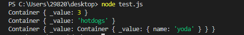
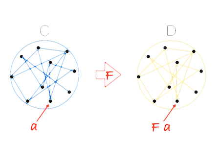

原书：[《看完就够用的函数式编程》](https://llh911001.gitbooks.io/mostly-adequate-guide-chinese/)

以下内容是我在阅读这本书时抽取整理的一些个人觉得有帮助的东西，相当于对书中内容做一个简化，方便自己学习理解。

## 引入函数式编程

从一个简单的例子开始说起。下面是一个海鸥程序，鸟群合并`conjoin`则变成了一个更大的鸟群，繁殖`breed`则增加了鸟群的数量，增加的数量就是它们繁殖出来的海鸥的数量。

```js
var Flock = function (n) {
  this.seagulls = n;
};
Flock.prototype.conjoin = function (other) {
  this.seagulls += other.seagulls;
  return this;
};
Flock.prototype.breed = function (other) {
  this.seagulls = this.seagulls * other.seagulls;
  return this;
};
var flock_a = new Flock(4);
var flock_b = new Flock(2);
var flock_c = new Flock(0);
var result = flock_a
  .conjoin(flock_c)
  .breed(flock_b)
  .conjoin(flock_a.breed(flock_b)).seagulls; //=> 32
```

这段代码其实并不好，它使得代码的内部可变状态变得非常难以追踪，而且最终的计算结果是错的，正确的答案应该是 16。这是因为 flock_a 在计算过程中被永久的改变了。

下面试试一种更函数式的写法

```js
var conjoin = function(flock_x, flock_y) {
  return flock_x + flock_y
};
var breed = function(flock_x, flock_y) {
  return flock_x * flock_ y
};
var flock_a = 4;
var flock_b = 2;
var flock_c = 0;
var result = conjoin(breed(flock_b, conjoin(flock_a, flock_c)),
                      breed(flock_a, flock_b)); //=>16
```

这段代码明显比上面的少写了很多，而且答案也是正确的。不过函数的嵌套不太好理解，仔细深究的话，我们会发现它其实是在进行简单的加`conjoin`和乘`breed`运算而已。把代码中的两个函数名换一下

```js
var add = function (x, y) {
  return x + y;
};
var multiply = function (x, y) {
  return x * y;
};
var flock_a = 4;
var flock_b = 2;
var flock_c = 0;
var result = add(
  multiply(flock_b, add(flock_a, flock_c)),
  multiply(flock_a, flock_b)
); //=>16
```

这样一来看着就比较熟悉了。下面是我们很早就学过的一些经典数学定律

```js
// 结合律（assosiative）
add(add(x, y), z) == add(x, add(y, z));

// 交换律（commutative）
add(x, y) == add(y, x);

// 同一律（identity）
add(x, 0) == x;

// 分配律（distributive）
multiply(x, add(y, z)) == add(multiply(x, y), multiply(x, z));
```

我们可以用这些定律继续简化上面的代码

```js
// 原有代码
add(multiply(flock_b, add(flock_a, flock_c)), multiply(flock_a, flock_b));

// 应用同一律，去掉多余的加法操作（add(flock_a, flock_c) == flock_a）
add(multiply(flock_b, flock_a), multiply(flock_a, flock_b));

// 再应用分配律
multiply(flock_b, add(flock_a, flock_a));
```

到这里，代码就变得很简洁明了了。只需要调用函数即可，没有多余的代码。

```js
var add = function (x, y) {
  return x + y;
};
var multiply = function (x, y) {
  return x * y;
};
var flock_a = 4;
var flock_b = 2;
var flock_c = 0;
var result = multiply(flock_b, add(flock_a, flock_a));
```

## 一等公民的函数

**1. 几个简单的例子**

当我们说函数是“一等公民”的时候，其实是说它们跟其他对象都一样，没什么特殊的，我们可以像对待任何其他数据类型一样对待它们——把它们存进数组、当作参数传递、赋值给变量等等。

这是 JavaScript 的基础概念，但是很多人其实会无视它。比如下面的代码

```js
const hi = (name) => `Hi ${name}`;
const greeting = (name) => hi(name);
```

这里 greeting 指向的那个把 hi 包了一层的包裹函数完全是多余的。因为 JavaScript 的函数是可调用的，当 hi 后面紧跟()的时候就会运行并返回一个值；如果没有(), hi 就简单地返回存到这个变量里的函数。

```js
hi; // name => `Hi ${name}`
hi("jonas"); // "Hi jonas"
```

因此上面的代码应该写成下面这样

```js
const greeting = hi;
greeting("times"); // "Hi times"
```

用一个函数把另一个函数包起来，目的仅仅是延迟执行，是一种非常糟糕的编程习惯。充分理解这个问题很重要，下面是几个类似例子

```js
// 太傻了
const getServerStuff = (callback) => ajaxCall((json) => callback(json));
```

上面这句代码可以一步一步转换成下面这样

```js
// 这行
ajaxCall(json => callback(json));

// 等价于这行
ajaxCall(callback);

// 那么，重构下
getServerStuff const getServerStuff = callback => ajaxCall(callback);

// ...就等于
const getServerStuff = ajaxCall // <-- 看，没有括号哦
```

还有下面这个例子

```js
const BlogController = {
  index(posts) {
    return Views.index(posts);
  },
  show(post) {
    return Views.show(post);
  },
  create(attrs) {
    return Db.create(attrs);
  },
  update(post, attrs) {
    return Db.update(post, attrs);
  },
  destroy(post) {
    return Db.destroy(post);
  },
};
```

可以重写成

```js
const BlogController = {
  index: Views.index,
  show: Views.show,
  create: Db.create,
  update: Db.update,
  destroy: Db.destroy,
};
```

以上才是写函数的正确方式。

**2. 为什么要将函数当成一等公民看待**

通过前面的例子可以看到，虽说添加一些没有实际用处的间接层实现起来很容易，但这样做除了徒增代码量，提高维护和检索代码的成本外，没有任何用处。

另外，如果一个函数被不必要地包裹起来了，而且发生了改动，那么包裹它的那个函数也要做相应的变更。

```js
httpGet("/post/2", (json) => renderPost(json));
```

如果 httpGet 要改成可以抛出一个可能出现的 err 异常，那我们还要回过头去把“胶水”函数也改了。

```js
// 把整个应用里的所有 httpGet 调用都改成这样，可以传递 err 参数。
httpGet("/post/2", (json, err) => renderPost(json, err));
```

如果一开始就写成一等公民函数的形式，需要改动的地方将会少得多

```js
httpGet("/post/2", renderPost); // renderPost 将会在 httpGet 中调用，想要多少参数都行
```

除了删除不必要的函数，正确地为参数命名也必不可少。项目中常见的一种造成混淆的原因是，针对同一个概念使用不同的命名。还有通用代码的问题。比如，下面这两个函数做的事情一模一样，但后一个就显得更加通用，可重用性也更高：

```js
// 只针对当前的博客
const validArticles = articles => articles.filter(article => article !== null && article !== undefined),

// 对未来的项目更友好
const compact = xs => xs.filter(x => x !== null && x !== undefined);
```

在命名的时候，我们特别容易把自己限定在特定的数据上（本例中是 articles ）。这种现象很常见，也是重复造轮子的一大原因。

还有一点需要特别注意的是 this 的使用，如果一个底层函数使用了 this ，而且是以一等公民的方式被调用的，可能会有问题。

```js
var fs = require("fs");

// 太可怕了
fs.readFile("freaky_friday.txt", Db.save);

// 好一点点
fs.readFile("freaky_friday.txt", Db.save.bind(Db));
```

把 Db 绑定（bind）到它自己身上以后，就可以随心所欲地调用它的原型链式垃圾代码了。 在函数式编程中，应该尽可能避免使用 this，因为根本用不到它。

## 纯函数的好处

**1. 什么是纯函数**

纯函数是这样一种函数，即**相同的输入，永远会得到相同的输出**，而且**没有任何可观察的副作用**。

比如`slice`和`splice`，这两个函数的作用差不多。但是，`slice`符合纯函数的定义，因为对相同的输入它保证能返回相同的输出；而`splice`却会永久的改变原来的数组，这就会产生可观察的副作用。

```js
var xs = [1, 2, 3, 4, 5];

// 纯的
xs.slice(0, 3); //=> [1,2,3]
xs.slice(0, 3); //=> [1,2,3]
xs.slice(0, 3); //=> [1,2,3]

// 不纯的
xs.splice(0, 3); //=> [1,2,3]
xs.splice(0, 3); //=> [4,5]
xs.splice(0, 3); //=> []
```

在函数式编程中，不喜欢这种会改变原数据的函数，而是需要那种可靠的，每次都能返回同样结果的函数。

再看另外一个例子

```js
// 不纯的
var minimum = 21;
var checkAge = function (age) {
  return age >= minimum;
};

// 纯的
var checkAge = function (age) {
  var minimum = 21;
  return age >= minimum;
};
```

第一个不纯是因为 checkAge 的结果取决于 minimum 这个可变变量的值。

使用纯函数的形式，函数就能做到自给自足。可以让 minimum 成为一个不可变（immutable）对象，这样就能保证纯粹性，因为状态不会有变化。要实现这个效果，必须得创建一个对象，然后调用`Object.freeze`方法：

```js
var immutableState = Object.freeze({
  minimum: 21,
});
```

**2. 副作用包括什么**

副作用是**在计算结果的过程中，系统状态的一种变化**，或者**与外部世界进行的可观察的交互**。

副作用可能包含，但不限于：

- 更改文件系统
- 往数据库插入记录
- 发送一个 http 请求
- 可变数据
- 打印/log
- 获取用户输入
- DOM 查询
- 访问系统状态

简单来说，**只要是跟函数外部环境发生的交互就都是副作用**——这一点可能会让你怀疑无副作用编程的可行性。函数式编程的哲学就是假定副作用是造成不正当行为的主要原因。

但这并不是说要禁止使用一切副作用，而是说，要让它们在可控的范围内发生。

副作用让一个函数变得不纯是有道理的：从定义上来说，纯函数必须要能够根据相同的输入返回相同的输出；如果函数需要跟外部事物打交道，那么就无法保证这一点了。

**3. 为何需要坚持相同输入得到相同输出的原则呢？**

回顾下在数学中学到的函数的概念。

函数是不同数值之间的特殊关系：**每一个输入值返回且只返回一个输出值**。

换句话说，**函数只是两种数值之间的关系：输入和输出**。尽管每个输入都只会有一个输出，但不同的输入却可以有相同的输出。下图展示了一个合法的从 x 到 y 的函数关系；


相反，下面这张图表展示的就不是一种函数关系，因为输入值 5 指向了多个输出：


如果输入直接指明了输出，那么就没有必要再实现具体的细节了。因为函数仅仅只是输入到输出的映射而已，所以简单地写一个对象就能“运行”它，使用 [] 代替 () 即可。

```js
var toLowerCase = { A: "a", B: "b", C: "c", D: "d", E: " e", D: "d" };
toLowerCase["C"]; //=> "c"

var isPrime = { 1: false, 2: true, 3: true, 4: false, 5: true, 6: false };
isPrime[3]; //=> true
```

这个例子也表明了另外一种思考函数的方式。

**纯函数就是数学上的函数，而且是函数式编程的全部**。

**4. 纯函数的好处**

- **可缓存性（Cacheable）**

纯函数总是能够根据输入来做缓存。实现缓存的一种典型方式是`memoize`技术，下面就是一个简单的实现：

```js
var memoize = function (f) {
  var cache = {};
  return function () {
    var arg_str = JSON.stringify(arguments);
    cache[arg_str] = cache[arg_str] || f.apply(f, arguments);
    return cache[arg_str];
  };
};
var squareNumber = memoize(function (x) {
  return x * x;
});

console.log(squareNumber(4));
//=> 16

console.log(squareNumber(4)); // 从缓存中读取输入值为 4 的结果
//=> 16

squareNumber(5);
//=> 25

squareNumber(5); // 从缓存中读取输入值为 5 的结果
//=> 25
```

值得注意的一点是，可以通过延迟执行的方式把不纯的函数转换为纯函数。

```js
var pureHttpCall = memoize(function(url, params){
  return function() { return $.getJSON(url, params); }
});
```

这里有趣的地方在于我们并没有真正发送 http 请求——只是返回了一个函数，当调用它的时候才会发请求。这个函数之所以有资格成为纯函数，是因为它总是会根据相同的输入返回相同的输出：给定了 url 和 params 之后，它就只会返回同一个发送 http 请求的函数。

- **可移植性／自文档化（Portable / Self- Documenting）**

纯函数是完全自给自足的，它需要的所有东西都能轻易获得。这种自给自足的好处是什么呢？

首先，**纯函数的依赖很明确，因此更易于观察和理解**。

```js
// 不纯的
var signUp = function(attrs) {
  var user = saveUser(attrs);
  welcomeUser(user);
};

var saveUser = function(attrs) {
    var user = Db.save(attrs);
    ...
};

var welcomeUser = function(user) {
    Email(user, ...);
    ...
};

// 纯的
var signUp = function(Db, Email, attrs) {
  return function() {
    var user = saveUser(Db, attrs);
    welcomeUser(Email, user);
  };
};

var saveUser = function(Db, attrs) {
    ...
};

var welcomeUser = function(Email, user) {
    ...
};
```

这个例子表明，纯函数对于其依赖必须要诚实，这样我们就能知道它的目的。仅从纯函数版本的 signUp 的签名就可以看出，它将要用到 Db、Email 和 attrs，这在最小程度上给了我们足够多的信息。

这里关注的重点就是，**相比不纯的函数，纯函数能够提供多得多的信息**。

其次，**通过强迫“注入”依赖，或者把它们当作参数传递，我们的应用也更加灵活**；因为数据库或者邮件客户端等等都参数化了。如果要使用另一个 Db，只需把它传给函数就行了。如果想在一个新应用中使用这个可靠的函数，尽管把新的 Db 和 Email 传递过去就好了，非常简单。

在 JavaScript 的设定中，可移植性可以意味着把函数序列化（serializing）并通过 socket 发送。也可以意味着代码能够在 web workers 中运行。总之，可移植性是一个非常强大的特性。

命令式编程中“典型”的方法和过程都深深地根植于它们所在的环境中，通过状态、依赖和有效作用（available effects）达成；纯函数与此相反，它与环境无关，只要我们愿意，可以在任何地方运行它。

有句名言是Erlang 语言的作者 Joe Armstrong 说的这句话：“面向对象语言的问题是，它们永远都要随身携带那些隐式的环境。你只需要一个香蕉，但却得到一个拿着香蕉的大猩猩...以及整个丛林”。

- **可测试性（Testable）**

纯函数让测试更容易。只需要简单的给函数一个输入，然后断言输出就好了。

函数式编程的社区正在开创一些新的测试工具，能够帮助我们自动生成输入并断言输出。比如`Quickcheck`——一个为函数式环境量身定制的测试工具。

- **合理性（Reasonable）**

很多人相信使用纯函数最大的好处是**引用透明性（referential transparency）**。

什么是引用透明性呢？如果一段代码可以替换成它执行所得的结果，而且是在不改变整个程序行为的前提下替换的，那么我们就说这段代码是引用透明的。

由于纯函数总是能够根据相同的输入返回相同的输出，所以它们就能够保证总是返回同一个结果，这也就保证了引用透明性。来看下面这个例子：

```js
var Immutable = require('immutable');

var decrementHP = function(player) {
  return player.set("hp", player.hp-1);
};

var isSameTeam = function(player1, player2) {
  return player1.team === player2.team;
};

var punch = function(player, target) {
  if(isSameTeam(player, target)) {
    return target;
  } else {
    return decrementHP(target);
  }
};

var jobe = Immutable.Map({name:"Jobe", hp:20, team: "red"});
var michael = Immutable.Map({name:"Michael", hp:20, team: "green"});

punch(jobe, michael);
//=> Immutable.Map({name:"Michael", hp:19, team: "green"})
```

decrementHP、isSameTeam 和 punch 都是纯函数，所以是引用透明的。我们可以使用一种叫做“**等式推导**”（equational reasoning）的技术来分析代码。所谓“等式推导”就是“一对一”替换，有点像在不考虑程序性执行的怪异行为（quirks of programmatic evaluation）的情况下，手动执行相关代码。我们借助引用透明性来剖析一下这段代码。

首先内联 isSameTeam 函数：

```js
var punch = function(player, target) {
  if(player.team === target.team) {
    return target;
  } else {
    return decrementHP(target);
  }
};
```

因为是不可变数据，我们可以直接把 team 替换为实际值：

```js
var punch = function(player, target) {
  if("red" === "green") {
    return target;
  } else {
    return decrementHP(target);
  }
};
```

if 语句执行结果为 false，所以可以把整个 if 语句都删掉：

```js
var punch = function(player, target) {
  return decrementHP(target);
};
```

如果再内联 decrementHP，我们会发现这种情况下，punch 变成了一个让 hp 的值减 1 的调用：

```js
var punch = function(player, target) {
  return target.set("hp", target.hp-1);
};
```

**等式推导带来的分析代码的能力对重构和理解代码非常重要**。事实上，我们重构海鸥程序使用的正是这项技术：利用加和乘的特性。

- **并行代码**

这是最后一点好处，也是决定性的一点：**我们可以并行运行任意纯函数**。因为纯函数根本不需要访问共享的内存，而且根据其定义，纯函数也不会因副作用而进入竞争态（race condition）。

并行代码在服务端 js 环境以及使用了 web worker 的浏览器那里是非常容易实现的，因为它们使用了线程（thread）。不过出于对非纯函数复杂度的考虑，当前主流观点还是避免使用这种并行。

## 柯里化

**1. 什么是函数的柯里化(curry)**

curry 的概念很简单：**只传递给函数一部分参数来调用它，让它返回一个函数去处理剩下的参数**。

可以一次性调用 curry 函数，也可以每次只传一个参数分多次调用。

```js
var add = function(x) {
  return function(y) {
    return x + y;
  };
};
var increment = add(1);
var addTen = add(10);

increment(2); // 3
addTen(2); // 12
```

这里我们定义了一个 add 函数，它接受一个参数并返回一个新的函数。调用 add 之后，返回的函数就**通过闭包的方式**记住了 add 的第一个参数。

下面是一些 curry 函数的例子

```js
var curry = require('lodash').curry;

var match = curry(function(what, str) {
  return str.match(what);
});

var replace = curry(function(what, replacement, str) {
  return str.replace(what, replacement);
});

var filter = curry(function(f, arr) {
  return arr.filter(f);
});

var map = curry(function(f, arr) {
  return arr.map(f);
});
```

上面的代码遵循了一种简单，同时也非常重要的模式。即策略性的**把要操作的数据(String, Array)放到最后一个参数里**。

```js
match(/\s+/g, "hello world"); // /\s+/g 这段正则表达式的作用是匹配空格，g表示全文查找
// [ ' ' ]

match(/\s+/g)("hello world");
// [ ' ' ]

var hasSpaces = match(/\s+/g);
// function(x) { return x.match(/\s+/g) }

hasSpaces("hello world");
// [ ' ' ]

hasSpaces("spaceless");
// null

filter(hasSpaces, ["tori_spelling", "tori amos"]);
// ["tori amos"]

var findSpaces = filter(hasSpaces);
// function(xs) { return xs.filter(function(x) { return x.match(/\s+/g) }) }

findSpaces(["tori_spelling", "tori amos"]);
// ["tori amos"]

var noVowels = replace(/[aeiou]/ig); // /[aeiou]/ig 这句正则表达式的作用是匹配aeiou这几个字母,ig表示全文查找，忽略大小写
// function(replacement, x) { return x.replace(/[aeiou]/ig, replacement) }

var censored = noVowels("*");
// function(x) { return x.replace(/[aeiou]/ig, "*") }

censored("Chocolate Rain");
// 'Ch*c*l*t* R**n'
```

这些例子表明的是一种“预加载”函数的能力，通过传递一到两个参数调用函数，就能得到一个记住了这些参数的新函数。

curry 的用处非常广泛。用 map 简单地把参数是单个元素的函数包裹一下，就能把它转换成参数为数组的函数。

```js
var getChildren = function(x) {
  return x.childNodes;
};

var allTheChildren = map(getChildren);
```

**只传给函数一部分参数**通常也叫做**局部调用（partial application）**，能够大量减少样板文件代码（boilerplate code）。

上面的 allTheChildren 函数，如果用 lodash 的普通 map 来写是下面这样的（注意参数顺序也变了）：

```js
var allTheChildren = function(elements) {
  return _.map(elements, getChildren);
};
```

通常我们不定义直接操作数组的函数，因为只需内联调用 map(getChildren) 就能达到目的。这一点同样适用于 sort、filter 以及其他的高阶函数（higher order function）（高阶函数：参数或返回值为函数的函数）。

当我们谈论纯函数的时候，我们说它们接受一个输入返回一个输出。curry 函数所做的正是这样：**每传递一个参数调用函数，就返回一个新函数处理剩余的参数**。

哪怕输出是另一个函数，它也是纯函数。当然 curry 函数也允许一次传递多个参数，但这只是出于减少 () 的方便。

下面是一些练习题

这些练习题默认使用 ramda 这个库来把函数转为 curry 函数。我们也可以使用由 lodash 的作者编写和维护的 lodash-fp。这两个库都很好用。

[练习题单元测试](https://github.com/llh911001/mostly-adequate-guide-chinese/tree/master/code/part1_exercises)

[练习题答案](https://github.com/llh911001/mostly-adequate-guide-chinese/tree/master/code/part1_exercises/answers)

```js
var _ = require('ramda');


// 练习 1
//==============
// 通过局部调用（partial apply）移除所有参数

var words = function(str) {
  return split(' ', str);
};

// 练习 1a
//==============
// 使用 `map` 创建一个新的 `words` 函数，使之能够操作字符串数组

var sentences = undefined;


// 练习 2
//==============
// 通过局部调用（partial apply）移除所有参数

var filterQs = function(xs) {
  return filter(function(x){ return match(/q/i, x);  }, xs);
};


// 练习 3
//==============
// 使用帮助函数 `_keepHighest` 重构 `max` 使之成为 curry 函数

// 无须改动:
var _keepHighest = function(x,y){ return x >= y ? x : y; };

// 重构这段代码:
var max = function(xs) {
  return reduce(function(acc, x){
    return _keepHighest(acc, x);
  }, -Infinity, xs);
};


// 彩蛋 1:
// ============
// 包裹数组的 `slice` 函数使之成为 curry 函数
// //[1,2,3].slice(0, 2)
var slice = undefined;


// 彩蛋 2:
// ============
// 借助 `slice` 定义一个 `take` curry 函数，该函数调用后可以取出字符串的前 n 个字符。
var take = undefined;
```

## 代码组合

**1. 函数饲养**

下面的代码就是组合`compose`

```js
var compose = function(f, g) {
  return function(x) {
    return f(g(x));
  };
};
```

f 和 g 都是函数，x 是在它们之间通过“管道”传输的值。

组合看起来像是在饲养函数。我们就是饲养员，选择两个有特点又喜欢的函数，让它们结合，产下一个崭新的函数。组合的用法如下:

```js
var toUpperCase = function(x) {
  return x.toUpperCase();
};
var exclaim = function(x) {
  return x + '!';
};
var shout = compose(exclaim, toUpperCase);

shout("send in the clowns");
//=> "SEND IN THE CLOWNS!"
```

两个函数组合之后返回了一个新函数是完全讲得通的：**组合某种类型（本例中是函数）的两个元素本就该生成一个该类型的新元素**。把两个乐高积木组合起来绝不可能得到一个林肯积木。

在 compose 的定义中，**g 将先于 f 执行**，因此就创建了一个**从右到左**的数据流。这样做的可读性远远高于嵌套一大堆的函数调用，如果不用组合，shout 函数将会是这样的：

```js
var shout = function(x) {
  return exclaim(toUpperCase(x));
};
```

下面是一个顺序很重要的例子：

```js
var head = function(x) {
  return x[0];
};
var reverse = reduce(function(acc, x){
  return [x].concat(acc);
}, []);
var last = compose(head, reverse);

last(['jumpkick', 'roundhouse', 'uppercut']);
//=> 'uppercut'
```

reverse 反转列表，head 取列表中的第一个元素；所以结果就是得到了一个 last 函数，即取列表的最后一个元素。

所有的组合都具有下面的数学特性 —— 结合律。

```js
// 结合律（associativity）
var associative = compose(f, compose(g, h)) == compose(compose(f, g), h);
// true
```

根据结合律，如果想把字符串变为大写，可以这么写：

```js
compose(toUpperCase, compose(head, reverse));

// 或者
compose(compose(toUpperCase, head), reverse);
```

因为如何为 compose 的调用分组不重要，所以结果都是一样的。这也让我们可以写一个可变的组合（variadic compose），用法如下：

```js
// 前面的例子中我们必须要写两个组合才行，但既然组合是符合结合律的，我们就可以只写一个，
// 而且想传给它多少个函数就传给它多少个，然后让它自己决定如何分组。

var lastUpper = compose(toUpperCase, head, reverse);

lastUpper(['jumpkick', 'roundhouse', 'uppercut']);
//=> 'UPPERCUT'


var loudLastUpper = compose(exclaim, toUpperCase, head, reverse)

loudLastUpper(['jumpkick', 'roundhouse', 'uppercut']);
//=> 'UPPERCUT!'
```

结合律的一大好处是**任何一个函数分组都可以被拆开来，然后再以它们自己的组合方式打包在一起**。如果重构前面的例子，可以是：

```js
var loudLastUpper = compose(exclaim, toUpperCase, head, reverse);

// 或
var last = compose(head, reverse);
var loudLastUpper = compose(exclaim, toUpperCase, last);

// 或
var last = compose(head, reverse);
var angry = compose(exclaim, toUpperCase);
var loudLastUpper = compose(angry, last);

// 更多变种...
```

如何使用组合，通常来说，最佳实践就是**让组合可重用**，就像 last 和 angry 那样。

**2. pointfree**

pointfree 模式指的是，**函数无须提及将要操作的数据是什么样的**。具体的解释说明我觉得可以参考这篇文章：[Pointfree 编程指南风格](http://www.ruanyifeng.com/blog/2017/03/pointfree.html)。

一等公民的函数、柯里化（curry）以及组合协作起来非常有助于实现这种模式。

```js
// 非 pointfree，因为提到了数据：word
var snakeCase = function (word) {
  return word.toLowerCase().replace(/\s+/ig, '_');
};

// pointfree
var snakeCase = compose(replace(/\s+/ig, '_'), toLowerCase);
```

看到 replace 是如何被局部调用的了么？这里所做的事情就是通过管道把数据在接受单个参数的函数间传递。利用 curry，我们能够做到让每个函数都先接收数据，然后操作数据，最后再把数据传递到下一个函数那里去。另外注意在 pointfree 版本中，不需要 word 参数就能构造函数；而在非 pointfree 的版本中，必须要有 word 才能进行一切操作。

下面是另外一个例子

```js
// 非 pointfree，因为提到了数据：name
var initials = function (name) {
  return name.split(' ').map(compose(toUpperCase, head)).join('. ');
};

// pointfree
var initials = compose(join('. '), map(compose(toUpperCase, head)), split(' '));

initials("hunter stockton thompson");
// 'H. S. T'
```

pointfree 模式能够帮助我们减少不必要的命名，让代码保持简洁和通用。对函数式代码来说，pointfree 是非常好的石蕊试验，因为它能告诉我们一个函数是否是接受输入返回输出的小函数。比如，while 循环是不能组合的。不过你也要警惕，pointfree 就像是一把双刃剑，有时候也能混淆视听。并非所有的函数式代码都是 pointfree 的，不过这没关系。可以使用它的时候就使用，不能使用的时候就用普通函数。

**3. debug**

组合的一个常见错误是，在没有局部调用之前，就组合类似 map 这样接受两个参数的函数。

```js
var compose = function(f, g) {
  return function(x) {
    return f(g(x));
  };
};
var toUpperCase = function(x) {
  return x.toUpperCase();
};
var exclaim = function(x) {
  return x + '!';
};
var angry = compose(exclaim, toUpperCase);

// 错误做法：我们传给了 `angry` 一个数组，根本不知道最后传给 `map` 的是什么东西。
var latin = compose(map, angry, reverse);

latin(["frog", "eyes"]);
// error

// 正确做法：每个函数都接受一个实际参数。
var latin = compose(map(angry), reverse);

latin(["frog", "eyes"]);
// ["EYES!", "FROG!"])
```

如果在 debug 组合的时候遇到了困难，那么可以使用下面这个实用的，但是不纯的 `trace` 函数来追踪代码的执行情况。

```js
var trace = curry(function(tag, x){
  console.log(tag, x);
  return x;
});

var dasherize = compose(join('-'), toLower, split(' '), replace(/\s{2,}/ig, ' '));

dasherize('The world is a vampire');
// TypeError: Cannot read property 'apply' of undefined
```

这里报错了，来 trace 下：

```js
var dasherize = compose(join('-'), toLower, trace("after split"), split(' '), replace(/\s{2,}/ig, ' '));
// after split [ 'The', 'world', 'is', 'a', 'vampire' ]
```

通过追踪的结果可以发现，toLower 的参数是一个数组，所以需要先用 map 调用一下它。

```js
var dasherize = compose(join('-'), map(toLower), split(' '), replace(/\s{2,}/ig, ' '));

dasherize('The world is a vampire');

// 'the-world-is-a-vampire'
```

trace 函数允许我们在某个特定的点观察数据以便 debug。

组合背后其实是有一个强大的理论在做支撑的，这个理论就是**范畴学**。

**4. 范畴学**

范畴学（category theory）是数学中的一个抽象分支，能够**形式化**诸如集合论（set theory）、类型论（type theory）、群论（group theory）以及逻辑学（logic）等**数学分支中的一些概念**。范畴学主要处理**对象**（object）、**态射**（morphism）和**变化式**（transformation），而这些概念跟编程的联系非常紧密。

在范畴学中，有一个概念叫范畴。有着以下这些组件（component）的搜集（collection）就构成了一个范畴：

- 对象的搜集
- 态射的搜集
- 态射的组合
- `identity` 这个独特的态射

范畴学抽象到足以模拟任何事物。下面看看如何把范畴学应用到类型和函数上。

**对象的搜集**

对象就是数据类型，例如 String、Boolean、Number 和 Object 等等。通常我们把数据类型视作所有可能的值的一个集合（set）。像 Boolean 就可以看作是 [true, false] 的集合，Number 可以是所有实数的一个集合。把类型当作集合对待是有好处的，因为我们可以利用集合论（set theory）处理类型。

**态射的搜集**

态射是标准的、普通的纯函数。

**态射的组合**

前面已经知道组合函数 compose 是符合结合律的，其实组合律是在范畴学中对任何组合都适用的一个特性。

```js
var g = function(x){ return x.length; };
var f = function(x){ return x === 4; };
var isFourLetterWord = compose(f, g);
```

**identity 这个独特的态射**

下面是一个名为 `id` 的实用函数。这个函数接受任何输入然后原封不动地返回它：

```js
var id = function(x) {
  return x;
};
```

id 函数能够跟组合很好的配合使用。下面这个特性对所有的一元函数（unary function）（一元函数：只接受一个参数的函数）f 都成立：

```js
// identity

compose(id, f) == compose(f, id) == f // true
```

组合像一系列管道那样把不同的函数联系在一起，数据就可以也必须在其中流动——毕竟纯函数就是输入对输出。组合是高于其他所有原则的设计原则，这是因为组合让我们的代码简单而富有可读性。另外范畴学将在应用架构、模拟副作用和保证正确性方面扮演重要角色。

下面是一些练习题

```js
require('../../support');
var _ = require('ramda');
var accounting = require('accounting');

// 示例数据
var CARS = [
    {name: "Ferrari FF", horsepower: 660, dollar_value: 700000, in_stock: true},
    {name: "Spyker C12 Zagato", horsepower: 650, dollar_value: 648000, in_stock: false},
    {name: "Jaguar XKR-S", horsepower: 550, dollar_value: 132000, in_stock: false},
    {name: "Audi R8", horsepower: 525, dollar_value: 114200, in_stock: false},
    {name: "Aston Martin One-77", horsepower: 750, dollar_value: 1850000, in_stock: true},
    {name: "Pagani Huayra", horsepower: 700, dollar_value: 1300000, in_stock: false}
  ];

// 练习 1:
// ============
// 使用 _.compose() 重写下面这个函数。提示：_.prop() 是 curry 函数
var isLastInStock = function(cars) {
  var last_car = _.last(cars);
  return _.prop('in_stock', last_car);
};

// 练习 2:
// ============
// 使用 _.compose()、_.prop() 和 _.head() 获取第一个 car 的 name
var nameOfFirstCar = undefined;


// 练习 3:
// ============
// 使用帮助函数 _average 重构 averageDollarValue 使之成为一个组合
var _average = function(xs) { return reduce(add, 0, xs) / xs.length; }; // <- 无须改动

var averageDollarValue = function(cars) {
  var dollar_values = map(function(c) { return c.dollar_value; }, cars);
  return _average(dollar_values);
};


// 练习 4:
// ============
// 使用 compose 写一个 sanitizeNames() 函数，返回一个下划线连接的小写字符串：例如：sanitizeNames(["Hello World"]) //=> ["hello_world"]。

var _underscore = replace(/\W+/g, '_'); //<-- 无须改动，并在 sanitizeNames 中使用它

var sanitizeNames = undefined;


// 彩蛋 1:
// ============
// 使用 compose 重构 availablePrices

var availablePrices = function(cars) {
  var available_cars = _.filter(_.prop('in_stock'), cars);
  return available_cars.map(function(x){
    return accounting.formatMoney(x.dollar_value);
  }).join(', ');
};


// 彩蛋 2:
// ============
// 重构使之成为 pointfree 函数。提示：可以使用 _.flip()

var fastestCar = function(cars) {
  var sorted = _.sortBy(function(car){ return car.horsepower }, cars);
  var fastest = _.last(sorted);
  return fastest.name + ' is the fastest';
};
```

## 示例应用

**1. 声明式代码**

与命令式不同，声明式意味着我们要写表达式，而不是一步一步的指示。

以 SQL 为例，它就没有“先做这个，再做那个”的命令，有的只是一个指明我们想要从数据库取什么数据的表达式。至于如何取数据则是由它自己决定的。以后数据库升级也好，SQL 引擎优化也好，根本不需要更改查询语句。这是因为，有多种方式解析一个表达式并得到相同的结果。

以下几个例子可以帮助理解什么是声明式。

```js
// 命令式
var makes = [];
for (i = 0; i < cars.length; i++) {
  makes.push(cars[i].make);
}

// 声明式
var makes = cars.map(function(car) { return car.make; });
```

命令式的循环要求你必须先实例化一个数组，而且执行完这个实例化语句之后，解释器才继续执行后面的代码。然后再直接迭代 cars 列表，手动增加计数器，把各种零零散散的东西都展示出来。

而声明式的代码是一个表达式，它对执行顺序没有要求。而且，map 函数如何进行迭代，返回的数组如何收集，都有很大的自由度。它指明的是做什么，不是怎么做。

再看一个例子。

```js
// 命令式
var authenticate = function(form) {
  var user = toUser(form);
  return logIn(user);
};

// 声明式
var authenticate = compose(logIn, toUser);
```

命令式代码告诉我们每一步该做什么，这是一种一步接一步的执行方式。而 compose 表达式只是简单地指出了这样一个事实：用户验证是 toUser 和 logIn 两个行为的组合。这再次说明，声明式**为潜在的代码更新提供了支持**，使得我们的应用代码成为了一种高级规范（high level specification）。

因为声明式代码不指定执行顺序，所以它天然地适合进行并行运算。**它与纯函数一起解释了为何函数式编程是未来并行计算的一个不错选择**——我们真的不需要做什么就能实现一个并行／并发系统。

**2. 一个函数式的 flickr**

下面以一种声明式的、可组合的方式创建一个示例应用。暂时会使用一点点副作用，但是会把副作用的程度降到最低，让它们与纯函数代码分离开来。这个示例应用是一个浏览器 widget，功能是从 flickr 获取图片并在页面上展示。

首先是 html：

```html
<!DOCTYPE html>
<html>
  <head>
    <script src="https://cdnjs.cloudflare.com/ajax/libs/require.js/2.1.11/require.min.js"></script>
    <script src="flickr.js"></script>
  </head>
  <body></body>
</html>
```

flickr.js 如下：

```js
requirejs.config({
  paths: {
    ramda: 'https://cdnjs.cloudflare.com/ajax/libs/ramda/0.13.0/ramda.min',
    jquery: 'https://ajax.googleapis.com/ajax/libs/jquery/2.1.1/jquery.min'
  }
});

require([
  'ramda',
  'jquery'
],
function (_, $) {
  var trace = _.curry(function(tag, x) {
    console.log(tag, x);
    return x;
  });
  // app goes here
});
```

这里使用了 [ramda](https://ramdajs.com/) 这个类库，它提供了 compose、curry 等很多函数。模块加载选择的是 requirejs。此外，trace 函数也写好了，便于 debug。

这个示例应用将要做4件事：

- 根据特定搜索关键字构造 url
- 向 flickr 发送 api 请求
- 把返回的 json 转为 html 图片
- 把图片放到屏幕上

上面提到了两个不纯的动作，即从 flickr 的 api 获取数据和在屏幕上放置图片这两件事。我们先来定义这两个动作，这样就能隔离它们了。

```js
var Impure = {
  getJSON: _.curry(function(callback, url) {
    $.getJSON(url, callback)
  }),

  setHtml: _.curry(function(sel, html) {
    $(sel).html(html)
  })
}
```

这里只是简单地包装了一下 jQuery 的 getJSON 方法，把它变为一个 curry 函数，还有就是把参数位置也调换了下。这些方法都在 Impure 命名空间下，这样我们就知道它们都是危险函数。在后面的例子中，我们会把这两个函数变纯。

下一步是构造 url 传给 Impure.getJSON 函数。

```js
var url = function (term) {
  return 'https://api.flickr.com/services/feeds/photos_public.gne?tags=' + term + '&format=json&jsoncallback=?';
};
```

下面写一个 app 函数发送请求并把内容放置到屏幕上。

```js
var app = _.compose(Impure.getJSON(trace('response')), url);

app('cat');
```

这会调用 url 函数，然后把字符串传给 getJSON 函数。getJSON 已经局部应用了 trace，加载这个应用将会把请求的响应显示在 console 里。


我们想要从这个 json 里构造图片，看起来 src 都在 items 数组中的每个 media 对象的 m 属性上。

我们可以使用 ramda 的一个通用 getter 函数 `_.prop()` 来获取这些嵌套的属性。但是为了知道这个函数做了什么事情，我们自己实现一个 prop 看看：

```js
var prop = _.curry(function(property, object) {
  return object[property]
})
```

可以看到这个函数只是用 [] 来获取一个对象的属性而已，下面就利用这个函数来获取图片的 src。

```js
var mediaUrl = _.compose(_.prop('m'), _.prop('media'))

var srcs = _.compose(_.map(mediaUrl), _.prop('items'))
```

一旦得到了 items，就必须使用 map 来分解每一个 url；这样就得到了一个包含所有 src 的数组。把它和 app 联结起来，打印结果看看。

```js
var renderImages = _.compose(Impure.setHtml('body'), srcs)

var app = _.compose(Impure.getJSON(renderImages), url)
```

这里新建了一个组合，这个组合会调用 srcs 函数，并把返回的结果设置为 body 的 html。其中，trace 也被替换成了 renderImages，因为已经有了除 json 以外的原始数据。这样会把所有的 src 直接显示在屏幕上。

最后一步是把这些 src 变为真正的图片。

```js
var img = function(url) {
  return $(``, { src: url })
}
```

jQuery 的 html() 方法接受标签数组为参数，所以我们只须把 src 转换为 img 标签然后传给 setHtml 即可。

```js
var images = _.compose(_.map(img), srcs)

var renderImages = _.compose(Impure.setHtml('body'), images)

var app = _.compose(Impure.getJSON(renderImages), url)
```

到这里，整个应用就完成了。

下面是完整的代码：

```js
requirejs.config({
  paths: {
    ramda: 'https://cdnjs.cloudflare.com/ajax/libs/ramda/0.13.0/ramda.min',
    jquery: 'https://ajax.googleapis.com/ajax/libs/jquery/2.1.1/jquery.min'
  }
});

require([
    'ramda',
    'jquery'
  ],
  function (_, $) {
    ////////////////////////////////////////////
    // Utils

    var Impure = {
      getJSON: _.curry(function(callback, url) {
        $.getJSON(url, callback);
      }),

      setHtml: _.curry(function(sel, html) {
        $(sel).html(html);
      })
    };

    var img = function (url) {
      return $('', { src: url });
    };

    var trace = _.curry(function(tag, x) {
      console.log(tag, x);
      return x;
    });

    ////////////////////////////////////////////

    var url = function (t) {
      return 'https://api.flickr.com/services/feeds/photos_public.gne?tags=' + t + '&format=json&jsoncallback=?';
    };

    var mediaUrl = _.compose(_.prop('m'), _.prop('media'));

    var srcs = _.compose(_.map(mediaUrl), _.prop('items'));

    var images = _.compose(_.map(img), srcs);

    var renderImages = _.compose(Impure.setHtml("body"), images);

    var app = _.compose(Impure.getJSON(renderImages), url);

    app("cats");
  });
```

这段代码展示的就是完完全全的声明式规范，**只说做什么，不说怎么做**。我们可以把每一行代码都视作一个等式，变量名所代表的属性就是等式的含义。我们可以利用这些属性去推导分析和重构这个应用。

**3. 有原则的重构**

上面的代码是有优化空间的，我们获取 url map 了一次，把这些 url 变为 img 标签又 map 了一次。关于 map 和组合是有定律的。

```js
// map 的组合律
var law = compose(map(f), map(g)) == map(compose(f, g))
```

可以利用这个定律优化代码，进行一次有原则的重构。

```js
// 原有代码
var mediaUrl = _.compose(_.prop('m'), _.prop('media'))

var srcs = _.compose(_.map(mediaUrl), _.prop('items'))

var images = _.compose(_.map(img), srcs)
```

根据等式推导和纯函数的特性，可以内联调用 srcs 和 images，也就是把 map 调用排列起来。

```js
var mediaUrl = _.compose(_.prop('m'), _.prop('media'))

var images = _.compose(_.map(img), _.map(mediaUrl), _.prop('items'))
```

把 map 排成一列之后就可以应用组合律了。

```js
var mediaUrl = _.compose(_.prop('m'), _.prop('media'))

var images = _.compose(_.map(_.compose(img, mediaUrl)), _.prop('items'))
```

这样只需要一次循环就可以把每一个对象都转为 img 标签了。把 map 调用的 compose 取出来放到外面，提高下可读性。

```js
var mediaUrl = _.compose(_.prop('m'), _.prop('media'))

var mediaToImg = _.compose(img, mediaUrl)

var images = _.compose(_.map(mediaToImg), _.prop('items'))
```

## Hindley-Milner 类型签名

**1. 初识类型**

刚接触函数式编程的人很容易深陷类型签名（type signatures）的泥淖。类型（type）是让所有不同背景的人都能高效沟通的元语言。很大程度上，类型签名是以 “Hindley-Milner” 系统写就的，本章我们将一起探究下这个系统。

类型签名在写纯函数时所起的作用非常大。短短一行，就能暴露函数的行为和目的。类型签名还衍生出了“自由定理（free theorems）”的概念。因为类型是可以推断的，所以明确的类型签名并不是必要的；既可以写精确度很高的类型签名，也可以让它们保持通用、抽象。类型签名不但可以用于编译时检测（compile time checks），还是最好的文档。所以它在函数式编程中扮演着非常重要的角色。

JavaScript 是一种动态类型语言，但这并不意味着要一味否定类型。我们还是要和字符串、数值、布尔值等等类型打交道的；只不过，语言层面上没有相关的集成让我们时刻谨记各种数据的类型罢了。既然我们可以用类型签名生成文档，也可以用注释来达到区分类型的目的。

JavaScript 也有一些类型检查工具，比如 Flow，或者它的静态类型方言 TypeScript 。由于本书的目标是让读者能够熟练使用各种工具去书写函数式代码，所以我们将选择所有函数式语言都遵循的标准类型系统。

```js
// capitalize :: String -> String
var capitalize = function (s) {
  return toUpperCase(head(s)) + toLowerCase(tail(s))
}

capitalize('smurf') // Smurf
```

这里，capitalize 接受一个 String 并返回了一个 String。

**在 Hindley-Milner 系统中，函数都写成类似 `a -> b` 这个样子，其中 a 和 b 是任意类型的变量**。因此，capitalize 函数的类型签名可以理解为“一个接受 String 并返回 String 的函数”。换句话说，**它接受一个 String 类型作为输入，并返回一个 String 类型的输出**。

下面是一些函数签名的例子：

```js
// strLength :: String -> Number
var strLength = function (s) {
  return s.length
}

// join :: String -> [String] -> String
var join = curry(function (what, xs) {
  return xs.join(what)
})

// match :: Regex -> String -> [String]
var match = curry(function (reg, s) {
  return s.match(reg)
})

// replace :: Regex -> String -> String -> String
var replace = curry(function (reg, sub, s) {
  return s.replace(reg, sub)
})
```

strLength 和 capitalize 类似：接受一个 String 然后返回一个 Number。

至于其他的，第一眼看起来可能会比较疑惑。不过在还不完全了解细节的情况下，你尽可以**把最后一个类型视作返回值**。那么 match 函数就可以这么理解：**它接受一个 Regex 和一个 String，返回一个 [String]**。

不过，这个还有一个比较有意思的地方。对于 match 函数，我们可以把它的类型签名这样分组：

```js
// match :: Regex -> (String -> [String])
var match = curry(function (reg, s) {
  return s.match(reg)
})
```

把最后两个类型包在括号里就能反应更多的信息了。现在可以看到 **match 函数接受一个 Regex 作为参数，返回一个从 String 到 [String] 的函数**。因为 curry 造成的结果就是这样：给 match 函数一个 Regex，得到一个新函数，能够处理其 String 参数。这种看待方式有助于我们理解为何最后一个类型是返回值。

```js
//  match :: Regex -> (String -> [String])

//  onHoliday :: String -> [String]
var onHoliday = match(/holiday/ig)
```

每传一个参数，就会弹出类型签名最前面的那个类型。所以 onHoliday 就是已经有了 Regex 参数的 match。

```js
// replace :: Regex -> (String -> (String -> String))
var replace = curry(function (reg, sub, s) {
  return s.replace(reg, sub)
})
```

这段代码中，为 replace 加上这么多括号未免有些多余。所以这里的括号是完全可以省略的，如果我们愿意，可以一次性把所有的参数都传进来；所以，一种更简单的思路是：replace 接受三个参数，分别是 Regex、String 和另一个 String，返回的还是一个 String。

```js
// id :: a -> a
var id = function (x) {
  return x
}

// map :: (a -> b) -> [a] -> [b]
var map = curry(function (f, xs) {
  return xs.map(f)
})
```

id 函数接受任意类型的 a 并返回同一个类型的数据。**对于相同的变量名，其类型也一定相同**。这是非常重要的一个原则。所以这里需要注意：a -> b 可以是从任意类型的 a 到任意类型的 b，但是 a -> a 必须是同一个类型。例如，id 可以是 String -> String，也可以是 Number -> Number，但不能是 String -> Bool。

相似地，map 也使用了变量，只不过这里的 b 可能与 a 类型相同，也可能不相同。我们可以这么理解：map 接受两个参数，第一个是从任意类型 a 到任意类型 b 的函数；第二个是一个数组，元素是任意类型的 a；map 最后返回的是一个类型 b 的数组。

从这些例子都可以看出，类型签名能够清晰的告诉我们一个函数做了什么事情。

**辨别类型和它们的含义是一项重要的技能，这项技能可以让你在函数式编程的路上走得更远**。不仅论文、博客和文档等更易理解，类型签名本身也基本上能够告诉你它的函数性（functionality）。要成为一个能够熟练读懂类型签名的人，你得勤于练习；不过一旦掌握了这项技能，你将会受益无穷，不读手册也能获取大量信息。

下面是另外一些例子：

```js
// head :: [a] -> a
var head = function (xs) {
  return xs[0]
}

// filter :: (a -> Bool) -> [a] -> [a]
var filter = curry(function (f, xs) {
  return xs.filter(f)
})

// reduce :: (b -> a -> b) -> b -> [a] -> b
var reduce = curry(function (f, x, xs) {
  return xs.reduce(f, x)
})
```

注意看 reduce 的签名，可以看到它的第一个参数是个函数，这个函数接受一个 b 和一个 a 并返回一个 b。那么这些 a 和 b 是从哪来的呢？很简单，签名中的第二个和第三个参数就是 b 和元素为 a 的数组，所以唯一合理的假设就是这里的 b 和每一个 a 都将传给前面说的函数作为参数。我们还可以看到，reduce 函数最后返回的结果是一个 b，也就是说，reduce 的第一个参数函数的输出就是 reduce 函数的输出。

**2. 缩小可能性范围**

一旦引入一个类型变量，就会出现一个奇怪的特性叫做 parametricity。这个特性表明，**函数将会以一种统一的行为作用于所有的类型**。

```js
// head :: [a] -> a
```

注意看 head，可以看到它接受 [a] 返回 a。我们除了知道参数是个数组，其他的一概不知；所以函数的功能就只限于操作这个数组上。在它对 a 一无所知的情况下，它可能对 a 做什么操作呢？换句话说，**a 告诉我们它不是一个特定的类型，这意味着它可以是任意类型；那么我们的函数对每一个可能的类型的操作都必须保持统一。这就是 parametricity 的含义**。要让我们来猜测 head 的实现的话，唯一合理的推断就是它返回数组的第一个，或者最后一个，或者某个随机的元素；当然，head 这个命名应该能给我们一些线索。

再看一个例子：

```js
// reverse :: [a] -> [a]
```

仅从类型签名来看，reverse 可能的目的是什么？再次强调，它不能对 a 做任何特定的事情。它不能把 a 变成另一个类型，或者引入一个 b；这都是不可能的。那它可以排序么？答案是不能，没有足够的信息让它去为每一个可能的类型排序。它能重新排列么？可以的，我觉得它可以，但它必须以一种可预料的方式达成目标。另外，它也有可能删除或者重复某一个元素。重点是，不管在哪种情况下，类型 a 的多态性（polymorphism）都会大幅缩小 reverse 函数可能的行为的范围。

这种“可能性范围的缩小”（narrowing of possibility）允许我们利用类似 [Hoogle](https://hoogle.haskell.org/) 这样的类型签名搜索引擎去搜索我们想要的函数。类型签名所能包含的信息量真的非常大。

**3. 自由定理**

类型签名除了能够帮助我们推断函数可能的实现，还能够给我们带来自由定理（free theorems）。

```js
// head :: [a] -> a
compose(f, head) == compose(head, map(f));

// filter :: (a -> Bool) -> [a] -> [a]
compose(map(f), filter(compose(p, f))) == compose(filter(p), map(f));
```

第一个例子中，等式左边说的是，先获取数组的头部（即第一个元素），然后对它调用函数 f；等式右边说的是，先对数组中的每一个元素调用 f，然后再取其返回结果的头部。这两个表达式的作用是相等的，但是前者要快得多。

第二个例子 filter 也是一样。等式左边是说，先组合 f 和 p 检查哪些元素要过滤掉，然后再通过 map 实际调用 f（别忘了 filter 是不会改变数组中元素的，这就保证了 a 将保持不变）；等式右边是说，先用 map 调用 f，然后再根据 p 过滤元素。这两者也是相等的。

以上只是两个例子，但它们传达的定理却是普适的，可以应用到所有的多态性类型签名上。在 JavaScript 中，你可以借助一些工具来声明重写规则，也可以直接使用 compose 函数来定义重写规则。

**4. 类型约束**

最后一点需要注意的是，签名也可以把类型约束为一个特定的接口（interface）。

```js
// sort :: Ord a => [a] -> [b]
```

箭头左边表明：a 一定是个 Ord 对象。也就是说，a 必须要实现 Ord 接口。Ord 到底是什么？它是从哪来的？在一门强类型语言中，它可能就是一个自定义的接口，能够让不同的值排序。通过这种方式，我们不仅能够获取关于 a 的更多信息，了解 sort 函数具体要干什么，而且还能限制函数的作用范围。我们把这种接口声明叫做类型约束（type constraints）。

```js
// assertEqual :: (Eq a, Show a) => a -> a -> Assertion
```

这个例子中有两个约束：Eq 和 Show。它们保证了我们可以检查不同的 a 是否相等，并在有不相等的情况下打印出其中的差异。

## 容器

通过前面几章的学习，我们已经知道了如何书写函数式的程序，即通过管道把数据在一系列纯函数间传递的程序。并且，这些程序就是声明式的行为规范。但是，我们还不知道控制流（control flow）、异常处理（error handling）、异步操作（asynchronous actions）、状态（state）和作用（effect）。本章将对这些抽象概念赖以建立的基础作一番探究。

**1. 什么是容器**

首先我们创建一个容器，这个容器**能够装载任意类型的值**。它是一个对象，但我们不会为它添加面向对象观念下的属性和方法。它的作用就是一个存放宝贵数据的特殊盒子。

```js
var Container = function (x) {
  this._value = x
}
Container.of = function (x) {
  return new Container(x)
}
```

在这段代码中，Container 就是一个容器，Container.of 是构造器（constructor）。这样就不需要到处写 new 关键字了。但实际上不能这么简单的看待 of 函数，只是暂时先认为它是把值放到容器里的一种方式。

```js
Container.of(3) // Container(3)

Container.of('hotdogs') // Container('hotdogs')

Container.of(Container.of({name: 'yoda'})) // Container(Container({name: "yoda" }))
```

上面的结果是在浏览器中的运行结果，在 node 中的运行结果是下面这样的：



可以看到 Chrome 打印出来的才是正确的，不过这并不重要，重要的是我们需要理解 Container 是什么样的。

还有下面几点需要注意的：

- Container 是个**只有一个属性**的对象。尽管容器可以有不止一个的属性，但大多数容器还是只有一个。这里很随意的把 Container 的这个属性命名为 _value。

- _value 不能是某个特定的类型。在上面一开始提到容器的时候就说到了，容器能够装载任意类型的值。

- 数据一旦存放到 Container，就会一直存在那儿。可以用 ._value 来获取数据，但是这样做有悖初衷。

**2. 第一个 functor**

一旦容器里有了值，不管这个值是什么，我们就需要一种方法来让别的函数能够操作它。

```js
// (a -> b) -> Container(a) -> Container(b)
Container.prototype.map = function (f) {
  return Container.of(f(this._value))
}
```

这个 map 跟数组的 map 一样，除了前者的参数是 Container a 而后者是 [a]。它们的使用方法几乎一致：

```js
var Container = function (x) {
  this._value = x
}

Container.of = function (x) {
  return new Container(x)
}

Container.prototype.map = function (f) {
  return Container.of(f(this._value))
}

Container.of(2).map(function (two) {
  return two + 2
}) // 原书写的是输出 Container(4)，但是我在 Chrome 和 node 中看到的都是 Container {_value: 4}

Container.of('flamethrowers').map(function (s) {
  return s.toUpperCase()
}) // 原书：Container("FLAMETHROWERS")，Chorme 和 node：Container {_value: "FLAMETHROWERS"}

Container.of('bombs').map(concat(' away')).map(_.prop('length')) // Container(10)
```

这种方法能够让我们在不离开 Container 的情况下操作容器里的值。Container 里的值传递给 map 函数之后，就可以任我们操作；操作结束后，为了防止意外再把它放回它所属的 Container。这样做的好处是，我们能连续地调用 map，运行任何我们想运行的函数。甚至还可以改变值的类型，就像上面最后一个例子中那样。

如果我们能够一直调用 map，那不就是跟组合很像吗。这里面其实就是 functor 在起作用。

> functor 是实现了 map 函数并遵守一些特定规则的容器类型。

把值装进一个容器，而且只能使用 map 来处理它，这么做其实就相当于让容器自己去运用函数，好处是抽象，对函数运用的抽象。当 map 一个函数时，我们请求容器来运行这个函数。

**3. 第二种 functor —— Maybe**

通常称 Container 为 `Identity`，它与 id 函数的作用相同。除此之外，还有另外一种 functor，那就是实现了 map 函数的类似容器的数据类型，这种 functor 在调用 map 的时候能够提供非常有用的行为。下面就来定义一个这样的 functor。

```js
var Maybe = function (x) {
  this._value = x
}

Maybe.of = function (x) {
  return new Maybe(x)
}

Maybe.prototype.isNothing = function () {
  return (this._value === null || this._value === undefined)
}

Maybe.prototype.map = function (f) {
  return this.isNothing() ? Maybe.of(null) : Maybe.of(f(this._value))
}
```

Maybe 与 Container 看起来非常类似，但是有一点不同的是：**Maybe 会先检查自己的值是否为空，然后才调用传进来的函数**。这样我们在使用 map 的时候就能避免恼人的空值了（注意这个实现出于教学目的做了简化）。

```js
Maybe.of('Malkovich Malkovich').map(match(/a/ig)) // Maybe(['a', 'a'])

Maybe.of(null).map(match(/a/ig)) // Maybe(null)

Maybe.of({ name: 'Boris' }).map(_.prop('age')).map(add(10)) // Maybe(null)

Maybe.of({ name: 'Dinah', age: 14 }).MAP(_.prop('age')).map(add(10)) // Maybe(24)
```

注意看，当传给 map 的值是 null 时，代码并没有抛出错误。这是因为每一次 Maybe 要调用函数的时候，都会先检查它自己的值是否为空。

这种点记法（dot notation syntax）已经足够函数式了，但是正如在第 1 部分指出的那样，我们更想保持一种 pointfree 的风格。map 完全有能力以 curry 函数的方式来“代理”任何 functor：

```js
// map :: Functor f => (a -> b) -> f a -> f b
var map = curry(function (f, any_functor_at_all) {
  return any_functor_at_all.map(f)
})
```

这样我们就可以像平常一样使用组合，同时也能正常使用 map 了。这里在类型标签中偷偷引入了一个额外的标记：Functor f =>。这个标记告诉我们 f 必须是一个 functor。

在实际当中，Maybe 最常用在那些可能会无法成功返回结果的函数中。

```js
// safeHead :: [a] -> Maybe(a)
var safeHead = function (xs) {
  return Maybe.of(xs[0])
}

var streetName = compose(map(_.prop('street')), safeHead, _.prop('addresses'))

streetName({ addresses: [] }) // Maybe(null)

streetName({ addresses: [{street: 'Shady Ln.', number: 4201}] }) // Maybe('Shady Ln.')
```

safeHead 与一般的 _.head 类似，但是增加了类型安全保证。因为它引入了 Maybe，能够检测空值 null ，并返回一个 Maybe。因为我们想要的值都深藏在 Maybe 对象中，而且只能通过 map 来操作它。

有时候函数可以明确返回一个 Maybe(null) 来表明失败，比如：

```js
// withdraw :: Number -> Account -> Maybe(Account)
var withdraw = curry(function (amount, account) {
  return account.balance >= amount ?
    Maybe.of({ balance: account.balance - amount }) :
    Maybe.of(null)
})

//  finishTransaction :: Account -> String
var finishTransaction = compose(remainingBalance, updateLedger) // 假定这两个函数已经在别处定义好了

//  getTwenty :: Account -> Maybe(String)
var getTwenty = compose(map(finishTransaction), withdraw(20))

getTwenty({ balance: 200.00}) // Maybe("Your balance is $180.00")

getTwenty({ balance: 10.00}) // Maybe(null)
```

当余额不够时，withdraw 就会返回一个 Maybe(null)。withdraw 也显示出了它的多变性，使得我们后续的操作只能用 map 来进行。这个例子与前面例子不同的地方在于，这里的 null 是有意的。我们不用 Maybe(String) ，而是用 Maybe(null) 来发送失败的信号，这样程序在收到信号后就能立刻停止执行。

这一点很重要：如果 withdraw 失败了，map 就会切断后续代码的执行，因为它根本就不会运行传递给它的函数，即 finishTransaction。这正是预期的效果：如果取款失败，我们并不想更新或者显示账户余额。

那么，如何释放容器里的值呢？

如果我们想返回一个自定义的值然后还能继续执行后面的代码的话，是可以做到的；要达到这一目的，可以借助一个帮助函数 maybe：

```js
//  maybe :: b -> (a -> b) -> Maybe a -> b
var maybe = curry(function (x, f, m) {
  return m.isNothing() ? x : f(m.__value)
})

//  getTwenty :: Account -> String
var getTwenty = compose(
  maybe("You're broke!", finishTransaction), withdraw(20)
)


getTwenty({ balance: 200.00 }) // "Your balance is $180.00"

getTwenty({ balance: 10.00 }) // "You're broke!"
```

这样就可以要么返回一个静态值（与 finishTransaction 返回值的类型一致），要么继续愉快地在没有 Maybe 的情况下完成交易。maybe 使我们得以避免普通 map 那种命令式的 if/else 语句：if(x !== null) { return f(x) }。

总之，Maybe 能够非常有效地帮助我们增加函数的安全性。还有一点需要注意的，Maybe 的“真正”实现会把它分为两种类型：一种是非空值，另一种是空值。这种实现允许我们遵守 map 的 parametricity 特性，因此 null 和 undefined 依然能够被 map 调用，functor 里的值所需的那种普遍性条件也能得到满足。所以我们会经常看到 Some(x) / None 或者 Just(x) / Nothing 这样的容器类型在做空值检查，而不是 Maybe。

**4. “纯”错误处理——Either**

错误处理通常使用 Either 这个 functor。

```js
var Left = function (x) {
  this._value = x
}

Left.of = function (x) {
  return new Left(x)
}

Left.prototype.map = function (f) {
  return this
}

var Right = function (x) {
  this._value = x
}

Right.of = function (x) {
  return new Right(x)
}

Right.prototype.map = function (f) {
  return Right.of(f(this._value))
}
```

Left 和 Right 是 Either 的抽象类型的两个子类。它们的用法如下：

```js
Right.of('rain').map(function (str) { // Right('brain')
  return 'b' + str
})

Left.of('rain').map(function (str) { // Left('rain')
  return 'b' + str
})

Right.of({ host: 'localhost', port: 80 }).map(_.prop('host') // Right('localhost')

Left.of('rolls eyes...').map(_.prop('host')) // Left('rolls eyes...')
```

Left 会无视我们要 map 它的请求。Right 的作用就像是一个 Container（也就是 Identity）。这里强大的地方在于， **Left 有能力在它内部嵌入一个错误消息**。

假设有一个可能会失败的函数，比如根据生日计算年龄。确实，我们可以用 Maybe(null) 来表示失败并把程序引向另一个分支，但是这并没有告诉我们太多信息。很有可能我们想知道失败的原因是什么。用 Either 写一个这样的程序看看：

```js
var moment = require('moment')

// getAge :: Date -> User -> Either(String, Number)
var getAge = curry(function (now, user) {
  var birthdate = moment(user.birthdate, 'YYYY-MM-DD')
  if (!birthdate.isValid()) return Left.of('Birth date could not be parsed')
  return Right.of(now.diff(birthdate, 'years'))
})

getAge(moment(), { birthdate: '2011-06-05' }) // Right(9)

getAge(moment(), { birthdate: 'balloons!' }) // Left('Birth date could not be parsed')
```

这么一来，就像 Maybe(null)，当返回一个 Left 的时候就直接让程序短路。跟 Maybe(null) 不同的是，现在我们对程序为何脱离原先轨道至少有了一点头绪。

有一点要注意，这里返回的是 Either(String, Number)，意味着我们这个 Either 左边的值是 String，右边（也就是正确的值）的值是 Number。这个类型签名不是很正式，因为我们并没有定义一个真正的 Either 父类；但我们还是从这个类型那里了解到不少东西。它告诉我们，我们得到的要么是一条错误消息，要么就是正确的年龄值。

```js
// fortune :: Number -> String
var fortune = compose(concat('If you survive, you will be '), add(1))

// zoltar :: User -> Either(String, _)
var zoltar = compose(map(console.log), map(fortune), getAge(moment()))

zoltar({ birthdate: '2011-06-05' }) // "If you survive, you will be 10"  Right(undefined)

zoltar({birthdate: 'balloons!'}) // Left("Birth date could not be parsed")
```

如果 birthdate 合法，这个程序就会打印出正确的结果；如果不合法，我们就会收到一个带错误消息的 Left，尽管这个消息是稳稳当当地待在它的容器里的。

在这个例子中，我们根据 birthdate 的合法性来控制代码的逻辑分支，同时又让代码进行从右到左的直线运动，而不用爬过各种条件语句的大括号。

我们在 Right 分支的类型签名中使用 _ 表示一个应该忽略的值（在有些浏览器中，你必须要 console.log.bind(console) 才能把 console.log 当作一等公民使用）。

这个例子中，尽管 fortune 使用了 Either，它对每一个 functor 到底要干什么却是毫不知情的。前面例子中的 finishTransaction 也是一样。

通俗点来讲，**一个函数在调用的时候，如果被 map 包裹了，那么它就会从一个非 functor 函数转换为一个 functor 函数**。我们把这个过程叫做 **lift**。

一般情况下，**普通函数更适合操作普通的数据类型而不是容器类型，在必要的时候再通过 lift 变为合适的容器去操作容器类型**。这样做的好处是能得到更简单、重用性更高的函数，它们能够随需求而变，兼容任意 functor。

Either 并不仅仅只对合法性检查这种一般性的错误作用非凡，对一些更严重的、能够中断程序执行的错误比如文件丢失或者 socket 连接断开等，Either 同样效果显著。

但是，Either 的作用并不仅仅只是当作一个错误消息的容器，它还有更多的用处。比如，它表示逻辑或。再比如，它体现了范畴学里 coproduct 的概念，这个概念有很多特性值得利用。还比如，它是标准的 sum type（或者叫不交并集，disjoint union of sets），因为它含有的所有可能的值的总数就是它包含的那两种类型的总数。

Either 能做的事情多着呢，但是作为一个 functor，我们就用它处理错误。

就像 Maybe 可以有个 maybe 一样，Either 也可以有一个 either。两者的用法类似，但 either 接受两个函数（而不是一个）和一个静态值为参数。这两个函数的返回值类型一致：

```js
//  either :: (a -> c) -> (b -> c) -> Either a b -> c
var either = curry(function (f, g, e) {
  switch (e.constructor) {
    case Left:
      return f(e.__value)
    case Right:
      return g(e.__value)
  }
})

//  zoltar :: User -> _
var zoltar = compose(console.log, either(id, fortune), getAge(moment()))

zoltar({birthdate: '2005-12-12'})
// "If you survive, you will be 10"
// undefined

zoltar({birthdate: 'balloons!'});
// "Birth date could not be parsed"
// undefined
```

这里用到了 id 函数，其实它就是简单的复制了 Left 里的错误消息，然后把这个值传给 console.log 而已。

**5. 第四种 functor —— IO**

在关于纯函数的的那一章（即第 3 章）里，有一个很奇怪的例子。这个例子中的函数会产生副作用，但是我们通过把它包裹在另一个函数里的方式把它变得看起来像一个纯函数。这里还有一个类似的例子：

```js
//  getFromStorage :: String -> (_ -> String)
var getFromStorage = function(key) {
  return function() {
    return localStorage[key]
  }
}
```

要是我们没把 getFromStorage 包在另一个函数里，它的输出值就是不定的，会随外部环境变化而变化。有了这个结实的包裹函数（wrapper），同一个输入就总能返回同一个输出：一个从 localStorage 里取出某个特定的元素的函数。

那我们如何进到容器里，拿到藏在哪儿的东西呢？办法是有的，请看 IO：

```js
var IO = function (f) {
  this._value = f
}

IO.of = function (x) {
  return new IO(function () {
    return x
  })
}

IO.prototype.map = function (f) {
  return new IO(_.compose(f, this._value))
}
```

IO 跟之前的 functor 不同的地方在于，**它的 _value 总是一个函数**。

这里发生的事情跟我们在 getFromStorage 那里看到的一模一样：**IO 把非纯执行动作（impure action）捕获到包裹函数里，目的是延迟执行这个非纯动作**。就这一点而言，我们认为 **IO 包含的是被包裹的执行动作的返回值，而不是包裹函数本身**。这在 of 函数里很明显：IO(function(){ return x }) 仅仅是为了延迟执行，其实我们得到的是 IO(x)。

用法如下：

```js
// io_window :: IO window
var io_window = new IO(function () {
  return window
})

io_window.map(function (win) {
  return win.innerWidth  // IO(1430)
})

io_window.map(_.prop('location')).map(_.prop('href')).map(split('/')) // IO(["http:", "", "localhost:8000", "blog", "posts"])

// $ :: String -> IO [DOM]
var $ = function (selector) {
  return new IO(function () {
    return document.querySelectorAll(selector)
  })
}

$('#myDiv').map(head).map(function (div) {
  return div.innerHTML // IO('I am some inner html')
})
```

这里，io_window 是一个真正的 IO，我们可以直接对它使用 map。至于 $，则是一个函数，调用后会返回一个 IO。

```js
////// 纯代码库: lib/params.js ///////

//  url :: IO String
var url = new IO(function() {
  return window.location.href
})

//  toPairs =  String -> [[String]]
var toPairs = compose(map(split('=')), split('&'))

//  params :: String -> [[String]]
var params = compose(toPairs, last, split('?'))

//  findParam :: String -> IO Maybe [String]
var findParam = function(key) {
  return map(compose(Maybe.of, filter(compose(eq(key), head)), params), url)
}

////// 非纯调用代码: main.js ///////

// 调用 __value() 来运行它！
findParam("searchTerm").__value() // Maybe(['searchTerm', 'wafflehouse'])
```

lib/params.js 把 url 包裹在一个 IO 里，然后把它传给了调用者。

IO 的 __value 并不是它包含的值，也不是像两个下划线暗示那样是一个私有属性。__value 是手榴弹的弹栓，只应该被调用者以最公开的方式拉动。为了提醒用户它的变化无常，我们把它重命名为 unsafePerformIO 看看。

```js
var IO = function(f) {
  this.unsafePerformIO = f
}

IO.prototype.map = function(f) {
  return new IO(_.compose(f, this.unsafePerformIO))
}
```

**6. 异步任务**

处理异步代码，有一种更好的方式，它的名字以“F”开头。但是这种方式的内部机制过于复杂,所以我们就直接用 Quildreen Motta 的 [Folktale](http://ww7.folktalejs.org/) 里的 Data.Task （之前是 Data.Future）。下面是一些例子：

```js
// Node readfile example:
//=======================

var fs = require('fs')

//  readFile :: String -> Task(Error, JSON)
var readFile = function(filename) {
  return new Task(function(reject, result) {
    fs.readFile(filename, 'utf-8', function(err, data) {
      err ? reject(err) : result(data)
    })
  })
}

readFile("metamorphosis").map(split('\n')).map(head)
// Task("One morning, as Gregor Samsa was waking up from anxious dreams, he discovered that
// in bed he had been changed into a monstrous verminous bug.")


// jQuery getJSON example:
//========================

//  getJSON :: String -> {} -> Task(Error, JSON)
var getJSON = curry(function(url, params) {
  return new Task(function(reject, result) {
    $.getJSON(url, params, result).fail(reject)
  })
})

getJSON('/video', {id: 10}).map(_.prop('title'))
// Task("Family Matters ep 15")

// 传入普通的实际值也没问题
Task.of(3).map(function(three){ 
  return three + 1 // Task(4)
})
```

例子中的 reject 和 result 函数分别是失败和成功的回调。正如你看到的，我们只是简单地调用 Task 的 map 函数，就能操作将来的值，好像这个值就在那儿似的。

如果熟悉 promise 的话，map 就是 then，Task 就是一个 promise。

与 IO 类似，Task 在我们给它下命令之前是不会运行的。事实上，正因为它要等我们的命令，IO 实际就被纳入到了 Task 名下，代表所有的异步操作 —— readFile 和 getJSON 并不需要一个额外的 IO 容器来变纯。更重要的是，当我们调用它的 map 的时候，Task 工作的方式与 IO 几无差别：都是把对未来的操作的指示放在一个时间胶囊里，就像家务列表（chore chart）那样 —— 真是一种精密的拖延术。

我们**必须调用 fork 方法才能运行 Task**，这种机制与 unsafePerformIO 类似。但也有不同，不同之处就像 fork 这个名称表明的那样，它会 fork 一个子进程运行它接收到的参数代码，其他部分的执行不受影响，主线程也不会阻塞。fork 的使用如下：

```js
// Pure application
//=====================
// blogTemplate :: String

//  blogPage :: Posts -> HTML
var blogPage = Handlebars.compile(blogTemplate)

//  renderPage :: Posts -> HTML
var renderPage = compose(blogPage, sortBy('date'))

//  blog :: Params -> Task(Error, HTML)
var blog = compose(map(renderPage), getJSON('/posts'))


// Impure calling code
//=====================
blog({}).fork(
  function(error){
    $("#error").html(error.message)
  },
  function(page){
    $("#main").html(page)
  }
)

$('#spinner').show()
```

调用 fork 之后，Task 就赶紧跑去找一些文章，渲染到页面上。与此同时，我们在页面上展示一个 spinner，因为 fork 不会等收到响应了才执行它后面的代码。最后，我们要么把文章展示在页面上，要么就显示一个出错信息，视 getJSON 请求是否成功而定。

这里的控制流为何是线性的。我们只需要从下读到上，从右读到左就能理解代码，即便这段程序实际上会在执行过程中到处跳来跳去。这种方式使得阅读和理解应用程序的代码比那种要在各种回调和错误处理代码块之间跳跃的方式容易得多。

可以发现，Task 居然也包含了 Either！没办法，为了能处理将来可能出现的错误，它必须得这么做，因为普通的控制流在异步的世界里不适用。这自然是好事一桩，因为它天然地提供了充分的“纯”错误处理。

就算是有了 Task，IO 和 Either 这两个 functor 也照样能派上用场。

```js
// Postgres.connect :: Url -> IO DbConnection
// runQuery :: DbConnection -> ResultSet
// readFile :: String -> Task Error String

// Pure application
//=====================

//  dbUrl :: Config -> Either Error Url
var dbUrl = function(c) {
  return (c.uname && c.pass && c.host && c.db)
    ? Right.of("db:pg://"+c.uname+":"+c.pass+"@"+c.host+"5432/"+c.db)
    : Left.of(Error("Invalid config!"))
}

//  connectDb :: Config -> Either Error (IO DbConnection)
var connectDb = compose(map(Postgres.connect), dbUrl)

//  getConfig :: Filename -> Task Error (Either Error (IO DbConnection))
var getConfig = compose(map(compose(connectDB, JSON.parse)), readFile)


// Impure calling code
//=====================
getConfig("db.json").fork(
  logErr("couldn't read file"), either(console.log, map(runQuery))
)
```

这个例子中，我们在 readFile 成功的那个代码分支里利用了 Either 和 IO。Task 处理异步读取文件这一操作当中的不“纯”性，但是验证 config 的合法性以及连接数据库则分别使用了 Either 和 IO。

**7. 一点理论**

functor 的概念来自于范畴学，并满足一些定律。下面是这些实用的定律。

```js
// identity
map(id) === id

// composition
compose(map(f), map(g)) === map(compose(f, g))
```

可以在我们自己的 functor 上试验它们，验证它们是否成立。

```js
var idLaw1 = map(id);
var idLaw2 = id;

idLaw1(Container.of(2));
//=> Container(2)

idLaw2(Container.of(2));
//=> Container(2)

var compLaw1 = compose(map(concat(" world")), map(concat(" cruel")));
var compLaw2 = map(compose(concat(" world"), concat(" cruel")));

compLaw1(Container.of("Goodbye"));
//=> Container('Goodbye cruel world')

compLaw2(Container.of("Goodbye"));
//=> Container('Goodbye cruel world')
```

在范畴学中，functor 接受一个范畴的对象和态射（morphism），然后把它们映射（map）到另一个范畴里去。根据定义，这个新范畴一定会有一个单位元（identity），也一定能够组合态射。

可以把范畴想象成一个有着多个对象的网络，对象之间靠态射连接。那么 functor 可以把一个范畴映射到另外一个，而且不会破坏原有的网络。如果一个对象 a 属于源范畴 C，那么通过 functor F 把 a 映射到目标范畴 D 上之后，就可以使用 F a 来指代 a 对象。可能看图会更容易理解：



比如，Maybe 就把类型和函数的范畴映射到这样一个范畴：即每个对象都有可能不存在，每个态射都有空值检查的范畴。这个结果在代码中的实现方式是用 map 包裹每一个函数，用 functor 包裹每一个类型。这样就能保证每个普通的类型和函数都能在新环境下继续使用组合。从技术上讲，代码中的 functor 实际上是把范畴映射到了一个包含类型和函数的子范畴（sub category）上，使得这些 functor 成为了一种新的特殊的 endofunctor。

可以用一张图来表示这种态射及其对象的映射：


这张图除了能表示态射借助 functor F 完成从一个范畴到另一个范畴的映射之外，我们发现它还符合交换律，也就是说，顺着箭头的方向往前，形成的每一个路径都指向同一个结果。不同的路径意味着不同的行为，但最终都会得到同一个数据类型。这种形式化给了我们原则性的方式去思考代码——无须分析和评估每一个单独的场景，只管可以大胆地应用公式即可。比如下面这个具体的例子：

```js
//  topRoute :: String -> Maybe(String)
var topRoute = compose(Maybe.of, reverse);

//  bottomRoute :: String -> Maybe(String)
var bottomRoute = compose(map(reverse), Maybe.of);


topRoute("hi");
// Maybe("ih")

bottomRoute("hi");
// Maybe("ih")
```

或者看图：


functor 也能嵌套使用：

```js
var nested = Task.of([Right.of("pillows"), Left.of("no sleep for you")]);

map(map(map(toUpperCase)), nested);
// Task([Right("PILLOWS"), Left("no sleep for you")])
```

nested 是一个将来的数组，数组的元素有可能是程序抛出的错误。我们使用 map 剥开每一层的嵌套，然后对数组的元素调用传递进去的函数。可以看到，这中间没有回调、if/else 语句和 for 循环，只有一个明确的上下文。的确，我们必须要 map(map(map(f))) 才能最终运行函数。不想这么做的话，可以组合 functor。如下：

```js
var Compose = function(f_g_x){
  this.getCompose = f_g_x;
}

Compose.prototype.map = function(f){
  return new Compose(map(map(f), this.getCompose));
}

var tmd = Task.of(Maybe.of("Rock over London"))

var ctmd = new Compose(tmd);

map(concat(", rock on, Chicago"), ctmd);
// Compose(Task(Maybe("Rock over London, rock on, Chicago")))

ctmd.getCompose;
// Task(Maybe("Rock over London, rock on, Chicago"))
```

functor 组合是符合结合律的，而且之前我们定义的 Container 实际上是一个叫 Identity 的 functor。identity 和可结合的组合也能产生一个范畴，这个特殊的范畴的对象是其他范畴，态射是 functor。

练习

```js
require('../../support');
var Task = require('data.task');
var _ = require('ramda');

// 练习 1
// ==========
// 使用 _.add(x,y) 和 _.map(f,x) 创建一个能让 functor 里的值增加的函数

var ex1 = undefined


//练习 2
// ==========
// 使用 _.head 获取列表的第一个元素
var xs = Identity.of(['do', 'ray', 'me', 'fa', 'so', 'la', 'ti', 'do']);

var ex2 = undefined


// 练习 3
// ==========
// 使用 safeProp 和 _.head 找到 user 的名字的首字母
var safeProp = _.curry(function (x, o) { return Maybe.of(o[x]); });

var user = { id: 2, name: "Albert" };

var ex3 = undefined


// 练习 4
// ==========
// 使用 Maybe 重写 ex4，不要有 if 语句

var ex4 = function (n) {
  if (n) { return parseInt(n); }
};

var ex4 = undefined


// 练习 5
// ==========
// 写一个函数，先 getPost 获取一篇文章，然后 toUpperCase 让这片文章标题变为大写

// getPost :: Int -> Future({id: Int, title: String})
var getPost = function (i) {
  return new Task(function(rej, res) {
    setTimeout(function(){
      res({id: i, title: 'Love them futures'})
    }, 300)
  });
}

var ex5 = undefined


// 练习 6
// ==========
// 写一个函数，使用 checkActive() 和 showWelcome() 分别允许访问或返回错误

var showWelcome = _.compose(_.add( "Welcome "), _.prop('name'))

var checkActive = function(user) {
 return user.active ? Right.of(user) : Left.of('Your account is not active')
}

var ex6 = undefined


// 练习 7
// ==========
// 写一个验证函数，检查参数是否 length > 3。如果是就返回 Right(x)，否则就返回
// Left("You need > 3")

var ex7 = function(x) {
  return undefined // <--- write me. (don't be pointfree)
}


// 练习 8
// ==========
// 使用练习 7 的 ex7 和 Either 构造一个 functor，如果一个 user 合法就保存它，否则
// 返回错误消息。别忘了 either 的两个参数必须返回同一类型的数据。

var save = function(x){
  return new IO(function(){
    console.log("SAVED USER!");
    return x + '-saved';
  });
}

var ex8 = undefined
```

## Monad

**1. pointed functor**

关于我们先前创建的容器类型上的 of 方法，真实情况是，of 方法不是用来避免使用 new 关键字的，而是用来把值放到默认最小化上下文（default minimal context）中的。of 没有真正地取代构造器 —— 它是一个我们称之为 pointed 的重要接口的一部分。

> pointed functor 是实现了 of 方法的 functor。

这里的关键是把任意值丢到容器里然后开始到处使用 map 的能力。

```js
IO.of('tetris').map(concat('master')) // IO('tetris master')

Maybe.of(1336).map(add(1)) // Maybe(1337)

Task.of([{ id: 2 }, { id: 3 }]).map(_.prop('id')) // Task([2, 3])

Either.of('The past, present and future walk into a bar...').map(concat('it was tense'))
// Right("The past, present and future walk into a bar...it was tense.")
```

IO 和 Task 的构造器接受一个函数作为参数，而 Maybe 和 Either 的构造器可以接受任意值。

实现这种接口的动机是，我们希望能有一种通用、一致的方式往 functor 里填值，而且中间不会涉及到复杂性，也不会涉及到对构造器的特定要求。

“默认最小化上下文”这个术语可能不够精确，但是却很好地传达了这种理念：**我们希望容器类型里的任意值都能发生 lift，然后像所有的 functor 那样再 map 出去**。

每个 functor 都要有一种把值放进去的方式，对 Either 来说，它的方式就是 new Right(x)。我们为 Right 定义 of 的原因是，如果一个类型容器可以 map，那它就应该 map。但是 Left 破坏了这种模式。

要避免 new 关键字，可以借助一些标准的 JavaScript 技巧或者类库达到目的。推荐使用 folktale、ramda 或 fantasy-land 里的 functor 实例，因为它们同时提供了正确的 of 方法和不依赖 new 的构造器。

**2. join 方法**

monad 常被比喻为洋葱。看看下面这个常见的场景：

```js
// Support
// ===========================
var fs = require('fs');

//  readFile :: String -> IO String
var readFile = function(filename) {
  return new IO(function() {
    return fs.readFileSync(filename, 'utf-8');
  });
};

//  print :: String -> IO String
var print = function(x) {
  return new IO(function() {
    console.log(x);
    return x;
  });
}

// Example
// ===========================
//  cat :: IO (IO String)
var cat = compose(map(print), readFile);

cat(".git/config")
// IO(IO("[core]\nrepositoryformatversion = 0\n"))
```

这里得到的是一个 IO，只不过它陷进了另一个 IO。要想使用它，我们必须这样调用： map(map(f))；要想观察它的作用，必须这样： unsafePerformIO().unsafePerformIO()。

```js
//  cat :: String -> IO (IO String)
var cat = compose(map(print), readFile);

//  catFirstChar :: String -> IO (IO String)
var catFirstChar = compose(map(map(head)), cat);

catFirstChar(".git/config")
// IO(IO("["))
```

再来看另外一种场景：

```js
//  safeProp :: Key -> {Key: a} -> Maybe a
var safeProp = curry(function(x, obj) {
  return new Maybe(obj[x]);
});

//  safeHead :: [a] -> Maybe a
var safeHead = safeProp(0);

//  firstAddressStreet :: User -> Maybe (Maybe (Maybe Street) )
var firstAddressStreet = compose(
  map(map(safeProp('street'))), map(safeHead), safeProp('addresses')
);

firstAddressStreet(
  {addresses: [{street: {name: 'Mulburry', number: 8402}, postcode: "WC2N" }]}
);
// Maybe(Maybe(Maybe({name: 'Mulburry', number: 8402})))
```

这种嵌套 functor 的模式会时不时地出现，而且是 monad 的主要使用场景。

```js
var mmo = Maybe.of(Maybe.of("nunchucks"));
// Maybe(Maybe("nunchucks"))

mmo.join();
// Maybe("nunchucks")

var ioio = IO.of(IO.of("pizza"));
// IO(IO("pizza"))

ioio.join()
// IO("pizza")

var ttt = Task.of(Task.of(Task.of("sewers")));
// Task(Task(Task("sewers")));

ttt.join()
// Task(Task("sewers"))
```

如果有两层相同类型的嵌套，那么就可以用 join 把它们展平。monad 更完整的精确定义如下：

> monad 是可以展平（flatten）的 pointed functor。

一个 functor，只要它定义个了一个 join 方法和一个 of 方法，并遵守一些定律，那么它就是一个 monad。

join 的实现并不太复杂，我们来为 Maybe 定义一个：

```js
Maybe.prototype.join = function () {
  return this.isNothing() ? Maybe.of(null) : this._value
}
```

如果有一个 Maybe(Maybe(x))，那么 .__value 将会移除多余的一层，然后我们就能安心地从那开始进行 map。

既然已经有了 join 方法，我们把 monad 魔法作用到 firstAddressStreet 例子上，看看它的实际作用：

```js
// join :: Monad m => m (m a) -> m a
var join = function (mma) {
  return mma.join()
}

var firstAddressStreet = compose(join, map(safeProp('street')), join, map(safeHead), safeProp('addresses'))

firstAddressStreet(
  {addresses: [{street: {name: 'Mulburry', number: 8402}, postcode: "WC2N" }]}
) // Maybe({name: 'Mulburry', number: 8402})
```

为 IO 也定义一个 join 方法：

```js
IO.prototype.join = function () {
  return this.unsafePerformIO()
}
```

同样是简单的移除了一层容器。

```js
//  log :: a -> IO a
var log = function(x) {
  return new IO(function() { 
    console.log(x); return x;
  });
}

//  setStyle :: Selector -> CSSProps -> IO DOM
var setStyle = curry(function(sel, props) {
  return new IO(function() {
    return jQuery(sel).css(props);
  });
});

//  getItem :: String -> IO String
var getItem = function(key) {
  return new IO(function() {
    return localStorage.getItem(key);
  });
};

//  applyPreferences :: String -> IO DOM
var applyPreferences = compose(
  join, map(setStyle('#main')), join, map(log), map(JSON.parse), getItem
);


applyPreferences('preferences').unsafePerformIO();
// Object {backgroundColor: "green"}
// <div style="background-color: 'green'"/>
```

getItem 返回了一个 IO String，所以可以直接用 map 来解析它。log 和 setStyle 返回的都是 IO，所以必须要使用 join 来保证这里边的嵌套处于控制之中。

**3. chain 函数**

从上面的例子中可以注意到：我们总是在紧跟着 map 的后面调用 join。让我们把这个行为抽象到一个叫做 chain 的函数里。

```js
// chain :: Monad m => (a -> m b) -> m a -> m b
var chain = curry(function (f, m) {
  return m.map(f).join() // 或者 compose(join, map(f))(m)
})
```

这里仅仅是把 map/join 打包到一个函数中。chain 其实叫做 >>= （读作 bind）或者 flatMap，都是同一个概念的不同名称罢了。

使用 chain 来重构上面两个例子：

```js
// map/join
var firstAddressStreet = compose(
  join, map(safeProp('street')), join, map(safeHead), safeProp('addresses')
);
// chain
var firstAddressStreet = compose(
  chain(safeProp('street')), chain(safeHead), safeProp('addresses')
)

// map/join
var applyPreferences = compose(
  join, map(setStyle('#main')), join, map(log), map(JSON.parse), getItem
);
// chain
var applyPreferences = compose(
  chain(setStyle('#main')), chain(log), map(JSON.parse), getItem
)
```

重构后的代码简洁了一些。但 chain 的能力却远不止于此，因为 chain 可以轻松地嵌套多个作用，因此我们就能以一种纯函数式的方式来表示**序列**（sequence）和**变量赋值**（variable assignment）。

```js
// getJSON :: Url -> Params -> Task JSON
// querySelector :: Selector -> IO DOM

getJSON('/authenticate', {username: 'stale', password: 'crackers'})
  .chain(function(user) {
    return getJSON('/friends', {user_id: user.id});
});
// Task([{name: 'Seimith', id: 14}, {name: 'Ric', id: 39}]);


querySelector("input.username").chain(function(uname) {
  return querySelector("input.email").chain(function(email) {
    return IO.of(
      "Welcome " + uname.value + " " + "prepare for spam at " + email.value
    );
  });
});
// IO("Welcome Olivia prepare for spam at olivia@tremorcontrol.net");


Maybe.of(3).chain(function(three) {
  return Maybe.of(2).map(add(three));
});
// Maybe(5);


Maybe.of(null).chain(safeProp('address')).chain(safeProp('street'));
// Maybe(null);
```

chain 可以自动从任意类型的 map 和 join 衍生出来，就像这样：t.prototype.chain = function(f) { return this.map(f).join(); }。

第一个例子中，可以看到两个 Task 通过 chain 连接形成了一个异步操作的**序列** —— 它先获取 user，然后用 user.id 查找 user 的 friends。chain 避免了 Task(Task([Friend])) 这种情况。

第二个例子是用 querySelector 查找几个 input 然后创建一条欢迎信息。注意看我们是如何在最内层的函数里访问 uname 和 email 的 —— 这是**函数式变量赋值**的绝佳表现。因为 IO 大方地把它的值借给了我们，我们也要负起以同样方式把值放回去的责任 —— 不能辜负它的信任（还有整个程序的信任）。IO.of 非常适合做这件事，同时它也解释了为何 pointed 这一特性是 monad 接口得以存在的重要前提。不过，map 也能返回正确的类型：

```js
querySelector("input.username").chain(function(uname) {
  return querySelector("input.email").map(function(email) {
    return "Welcome " + uname.value + " prepare for spam at " + email.value;
  });
});
// IO("Welcome Olivia prepare for spam at olivia@tremorcontrol.net");
```

最后两个例子用了 Maybe。因为 chain 其实是在底层调用了 map，所以如果遇到 null，代码就会立刻停止运行。

总之记住，**返回的如果是“普通”值就用 map，如果是 functor 就用 chain**。

这种容器编程风格有时也能造成困惑，因为有时我们不得不努力理解一个值到底嵌套了几层容器，或者需要用 map 还是 chain。

下面这个例子是读一个文件，然后把它直接上传。

```js
// readFile :: Filename -> Either String (Future Error String)
// httpPost :: String -> Future Error JSON

// upload :: String -> Either String (Future Error JSON)
var upload = compose(
  map(chain(httpPost('/uploads'))), readFile
);
```

这里，代码不止一次在不同的分支执行。从类型签名可以看出，我们预防了三个错误——readFile 使用 Either 来验证输入（或许还有确保文件名存在）；readFile 在读取文件的时候可能会出错，错误通过 readFile 的 Future 表示；文件上传可能会因为各种各样的原因出错，错误通过 httpPost 的 Future 表示。我们就这么随意地使用 chain 实现了两个嵌套的、有序的异步执行动作。

所有这些操作都是在一个从左到右的线性流中完成的，是完完全全纯的、声明式的代码，是可以等式推导（equational reasoning）并拥有可靠特性（reliable properties）的代码。这个 upload 函数符合通用接口而不是特定的一次性接口。

把它跟标准的命令式的实现对比一下：

```js
var upload = function (filename, callback) {
  if (!filename) {
    throw 'You need a filename!'
  } else {
    readFile(filename, function (err, contents) {
      if (err) throw err
      httpPost(contents, function (err, json) {
        if (err) throw err
        callback(json)
      })
    })
  }
}
```

**4. 一点理论**

第一条定律是结合律，但不是我们熟悉的那个结合律。

```js
// 结合律
compose(join, map(join)) == compose(join, join)
```

这些定律表明了 monad 的嵌套本质，所以结合律关心的是如何让内层或外层的容器类型 join，然后取得同样的结果。用一张图来表示可能效果会更好：


从左上角往下，先用 join 合并 M(M(M a)) 最外层的两个 M，然后往右，再调用一次 join，就得到了我们想要的 M a。或者，从左上角往右，先打开最外层的 M，用 map(join) 合并内层的两个 M，然后再向下调用一次 join，也能得到 M a。不管是先合并内层还是先合并外层的 M，最后都会得到相同的 M a，所以这就是结合律。值得注意的一点是 map(join) != join。两种方式的中间步骤可能会有不同的值，但最后一个 join 调用后最终结果是一样的。

第二条定律是同一律，与结合律类似：

```js
// 同一律
compose(join, of) === compose(join, map(of)) == id
```