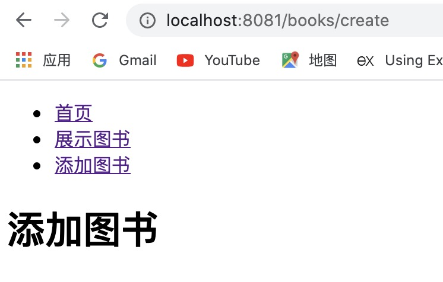
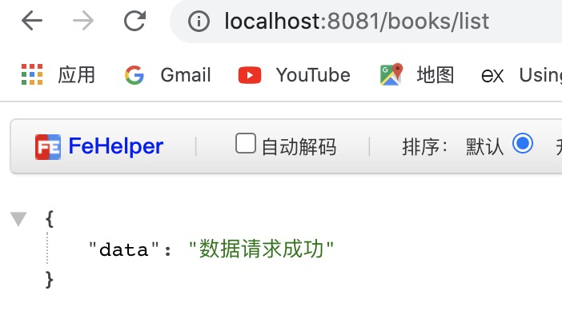
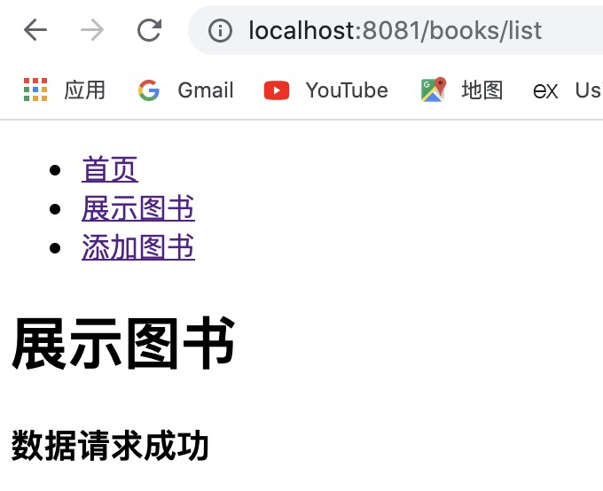
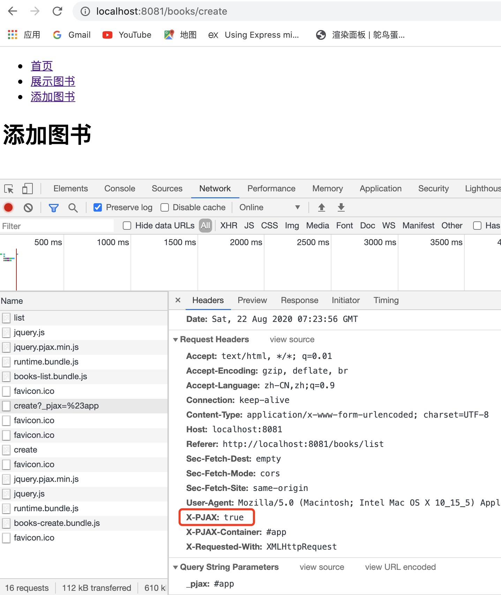
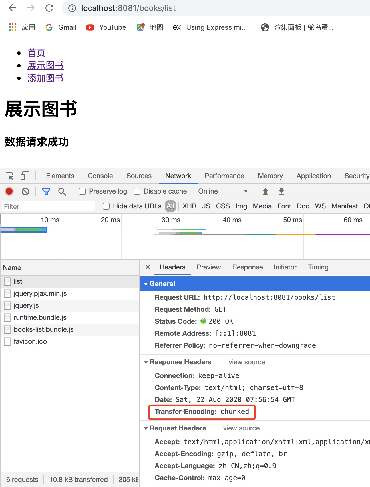
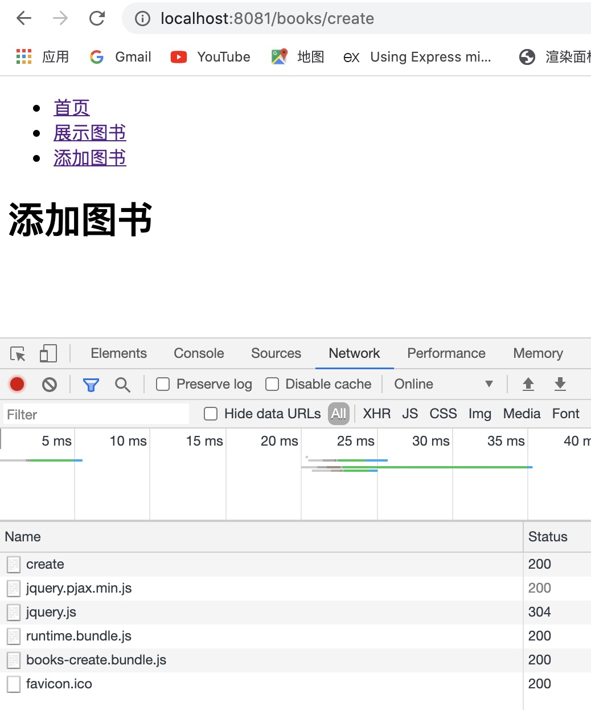
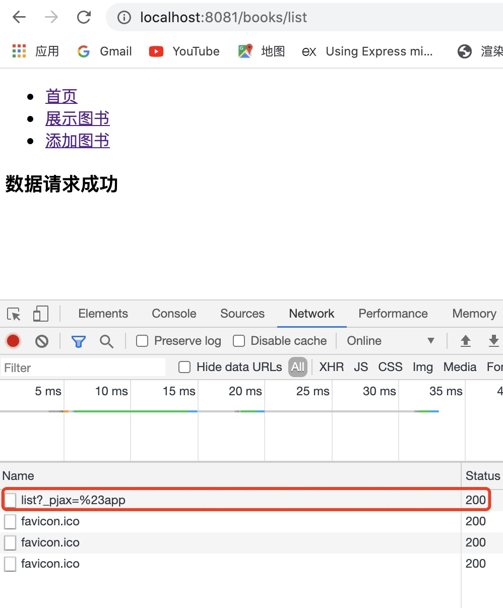
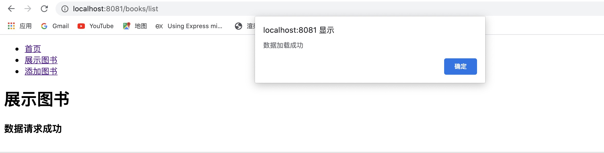
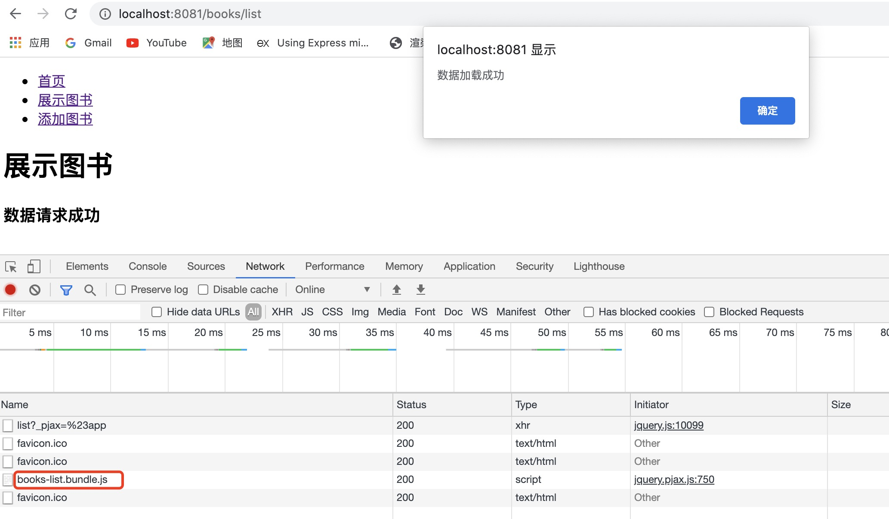

对前三次完成的项目，做进一步的优化改进。

## 依赖注入

提到依赖注入，就不得不提到 **IoC**。

- IoC 是 Inversion of Control 的缩写，称为**控制反转**。它是面向对象编程中的一个原则，主要用来降低代码之间的耦合度。实现 IoC 最常见的方式就是**依赖注入**（Dependency Injection，简称 **DI**）。

- 前端中的 IoC 最早是由 Angular 引进来的。在此之前，IoC 最常用于 Java 的 [Spring](https://spring.io/) 框架中。

在之前的项目中，我们在用到某个 controller 时，就需要手动将它导入，然后再 new 生成一个实例。这种方式太麻烦了，我们希望达到的结果是，某个 controller 里面需要用到某个服务的时候，能够自动注入。

下面就开始调整代码。

1. 首先，删掉 server/controllers 文件夹下的 index.js 和 Controller.js，并相应的删掉另外两个 controller 文件中的导入相关的语句。

```js
// IndexController.js
class IndexController {
  constructor() {}
  async actionIndex(ctx, next) {
    ctx.body = "首页";
  }
}

export default IndexController;

// BooksController.js
class BooksController {
  constructor() {}
  async actionIndex(ctx, next) {
    ctx.body = await ctx.render("books/pages/list");
  }
  async actionCreate(ctx, next) {
    ctx.body = await ctx.render("books/pages/create");
  }
}
export default BooksController;
```

2. 然后，把 models 文件夹重命名为 services，相当于服务的提供方。

3. 其次，删掉启动文件 app.js 中与路由相关的代码。

```js
import controllers from "./controllers";

controllers(app);
```

### Awilix

[Awilix](https://github.com/jeffijoe/awilix) 是一个使用 TypeScript 编写的 JavaScript / Node 极其强大的依赖注入（DI）容器。

除此之外，还有一个专门给 koa 使用的：[awilix-koa](https://github.com/jeffijoe/awilix-koa)。

1. 在 app.js 中加入以下代码，将所有的路由引进来。

```js
import { loadControllers } from "awilix-koa";
app.use(loadControllers(`${__dirname}/controllers/*.js`));
```

2. 在 BooksController 和 IndexController 中创建路由。

```js
// BooksController.js
import { route, GET } from "awilix-koa";

@route("/books")
class BooksController {
  constructor() {}
  @route("/list")
  @GET()
  async actionIndex(ctx, next) {
    ctx.body = await ctx.render("books/pages/list");
  }
  @route("/create")
  @GET()
  async actionCreate(ctx, next) {
    ctx.body = await ctx.render("books/pages/create");
  }
}
export default BooksController;
```

```js
// IndexController.js
import { route, GET } from "awilix-koa";

@route("/")
class IndexController {
  constructor() {}
  @route("/")
  @GET()
  async actionIndex(ctx, next) {
    ctx.body = "首页";
  }
}

export default IndexController;
```

3. 模拟假数据，并获取数据

将 services 文件夹下的 Book.js 重命名为 BooksService.js，并修改如下。

```js
// import { get } from 'axios';

class BooksService {
  getData() {
    // return get('http://localhost:8080/index.php?r=books');
    return Promise.resolve("数据请求成功");
  }
}

export default BooksService;
```

然后在 BooksController 中获取数据。

```js
import { route, GET } from "awilix-koa";

@route("/books")
class BooksController {
  constructor({ booksService }) {
    this.booksService = booksService;
  }
  @route("/list")
  @GET()
  async actionIndex(ctx, next) {
    const data = await this.booksService.getData();
    ctx.body = {
      data,
    };
    // ctx.body = await ctx.render('books/pages/list');
  }
  @route("/create")
  @GET()
  async actionCreate(ctx, next) {
    ctx.body = await ctx.render("books/pages/create");
  }
}
export default BooksController;
```

4. 在 app.js 中创建容器，并把所有的 services 交给容器管理，再统一注入进来。

```js
import { createContainer, Lifetime } from "awilix";
import { loadControllers, scopePerRequest } from "awilix-koa";

// 创建容器
const container = createContainer();
// 把所有的 services 交给容器管理
container.loadModules([`${__dirname}/services/*.js`], {
  formatName: "camelCase",
  resolverOptions: {
    lifetime: Lifetime.SCOPED,
  },
});
// 终极注入
app.use(scopePerRequest(container));
```

### @babel/plugin-proposal-decorators

1. 去 [babel](https://babeljs.io/) 官网找到并安装好这个装饰器的包之后，需要在 gulpfile.js 中的 plugins 进行配置。

```js
["@babel/plugin-proposal-decorators", { "legacy": true }],
```

2. 然后执行 npm run server:dev 启动服务，同时要把 dist 目录下的文件夹删成只剩下 assets、components 和 views 三个。不这样做的话可能会报错，因为那些文件不是按照现在的方式生成的。再重新启动下服务。

3. 新开一个终端，执行 npm run server:start 启动项目。在浏览器中访问就可以看到效果了。






到此，对路由的依赖注入改造就完成了。

接着，把 views 里的页面也调整下。

首先，把我们获取到的数据在图书列表页中展示出来。

```js
// BooksController.js
async actionIndex(ctx, next) {
    const data = await this.booksService.getData();
    ctx.body = await ctx.render('books/pages/list', {
        data
    });
}
```

然后，在 list 组件中补充内容

```html
<!-- /components/list/list.html -->
<div class="list">
  <h3>[[data]]</h3>
</div>
```

再将 list 页面和 create 页面改成引入 list 组件和 create 组件。

```html
<!-- /views/books/pages/list.html -->
<!-- 继承 layout.html -->


 图书列表页 


    <!-- injectcss -->



    <h1>展示图书</h1>
    <!-- 引入 list 组件 -->
    



    <!-- injectjs -->

```

```html
<!-- /views/books/pages/create.html -->
<!-- 继承 layout.html -->


 添加图书 


    <!-- injectcss -->



    <h1>添加图书</h1>
    <!-- 引入 create 组件 -->
    



    <!-- injectjs -->

```

最后，在 layout.html 中引入 banner 组件，就可以了。

```html
<!DOCTYPE html>
<html lang="en">
  <head>
    <meta charset="UTF-8" />
    <title></title>
    
  </head>
  <body>
    
    <div id="app">
      
    </div>
    
  </body>
</html>
```

运行 npm run client:dev 重新打包项目，再分别运行 npm run server:dev 和 npm run server:start 启动服务和启动项目。在浏览器中访问就能看到效果了。



## 使用 X-TAG 完成直刷 SSR 和切页 SPA

以上我们完成的多页应用（MPA）有个致命的缺点就是，每次我切换路由的时候，都会重新加载一遍所有的资源。

因此，我们需要解决这个问题，让页面在切换路由的时候不需要重新加载资源。

### jquery.pjax

1. 在 layout.html 中引入 pjax。

```html
<!DOCTYPE html>
<html lang="en">
  <head>
    <meta charset="UTF-8" />
    <title></title>
    
  </head>
  <body>
    
    <div id="app">
      
    </div>
    <script src="https://cdn.staticfile.org/jquery/3.5.1/jquery.js"></script>
    <script src="https://cdn.staticfile.org/jquery.pjax/2.0.1/jquery.pjax.min.js"></script>
    <script>
      $(document).pjax("a", "#app");
    </script>
    
  </body>
</html>
```

重新打包并运行项目之后，可以看到，当我们从列表页点击跳到新建页的时候，会有这样一个特殊的请求：**/books/create?\_pjax=%23app**，并且它会自动在请求头部那里加上 **X-PJAX: true** 的标记。



我们就可以根据这个标记来判断，当前页面是站内切的还是直接落地加载的。

比如，可以在 BooksController.js 中加一段代码测试下。

```js
 async actionIndex(ctx, next) {
    if (ctx.request.header['x-pjax']) { // 站内切
        console.log('站内切');
    } else { // 落地页
        console.log('落地页');
    }
    const data = await this.booksService.getData();
    ctx.body = await ctx.render('books/pages/list', {
        data
    });
}
```

当直接访问 http://localhost:8081/books/list 时，会打印出落地页；当从新建页通过点击跳转到列表页时，会先打印出站内切，再输出落地页，之所以会这样，是因为我们没在站内切那里做处理，拦截住，就会继续往下走，如果拦截了就只会输出站内切了。

### 使用 stream 流式传输页面

我们可以让页面是分块传输的，通过使用 stream，这样会比一整个页面整块传输好很多。

在 BooksController.js 中对列表页做下处理。

```js
async actionIndex(ctx, next) {
    const data = await this.booksService.getData();
    const html = await ctx.render('books/pages/list', {
        data
    });
    if (ctx.request.header['x-pjax']) { // 站内切
        console.log('站内切');
    } else { // 落地页
        function createSSRStreamPromise() {
            console.log('落地页');
            return new Promise((resolve, reject) => {
                const htmlStream = new Readable();
                htmlStream.push(html);
                htmlStream.push(null); // 表示已经处理完成了
                ctx.status = 200;
                ctx.type = 'html';
                htmlStream.on('error', (err) => {
                    reject(err);
                }).pipe(ctx.res);
            })
        }
        await createSSRStreamPromise()
    }
    // ctx.body = html;
}
```

此时，访问 http://localhost:8081/books/list 就可以看到 list 页面请求多了一个 `Transfer-Encoding: chunked`，表示我们的页面已经成功的采用流式方式进行传输了。



### cheerio

[cheerio](https://github.com/cheeriojs/cheerio/wiki/Chinese-README) 是为服务器特别定制的，快速、灵活、实施的 jQuery 核心实现。

在 list 组件中加一个标记 pjaxcontent，有这个标记的 html 就表示是需要拿出来渲染的 html。

```html
<!-- /components/list/list.html -->
<div class="list pjaxcontent">
    <h3>[[data]]</h3>
</div>
```

在 BooksController.js 中使用 cheerio。

```js
import cheerio from 'cheerio';

async actionIndex(ctx, next) {
    const data = await this.booksService.getData();
    const html = await ctx.render('books/pages/list', {
        data
    });
    if (ctx.request.header['x-pjax']) { // 站内切
        console.log('站内切');
        const $ = cheerio.load(html);
        ctx.status = 200;   // 需要手动修正状态，不然会出现一些奇怪的错误
        ctx.type = 'html';
        // 一块一块的渲染 html
        $('.pjaxcontent').each(function () {
            ctx.res.write($(this).html());
        });
        ctx.res.end();
    } else { // 落地页
        function createSSRStreamPromise() {
            console.log('落地页');
            return new Promise((resolve, reject) => {
                const htmlStream = new Readable();
                htmlStream.push(html);
                htmlStream.push(null); // 表示已经处理完成了
                ctx.status = 200;   // 需要手动修正状态，不然会出现一些奇怪的错误
                ctx.type = 'html';
                htmlStream.on('error', (err) => {
                    reject(err);
                }).pipe(ctx.res);
            })
        }
        await createSSRStreamPromise()
    }
    // ctx.body = html;
}
```

重新启动项目后，在浏览器中可以看到，当我们刷新页面的时候会加载一次资源，当从新建页点击跳转到列表页的时候，只加载了一个资源，不会重复加载公共的资源。





但是，这时候还有个问题，就是站内切的时候，组件的 js 文件会丢失。

比如现在我们需要用到 list.js。

```js
const list = {
    init() {
        $('#js-btn').click(function() {
            alert('数据加载成功');
        })
        console.log('list');
    }
}

export default list;
```

```html
<!-- /components/list/list.html -->
<div class="list pjaxcontent">
    <h1>展示图书</h1>
    <h3 id="js-btn">[[data]]</h3>
</div>
```

```js
// books-list.entry.js
import banner from '@/components/banner/banner.js';
import list from '@/components/list/list.js';
banner.init();
list.init();
```

当我们刷新 list 页面的时候，点击会正常弹出弹窗。



但是，如果我们是从 create 页面跳转到 list 页面，此时点击就没反应了，因为 js 文件丢失了。

解决这个问题的方法如下：

- 首先，在 HtmlAfterPlugin.js 中给组件的 js 加上一个 lazyload-js 标记，表示有这个标记的 js 文件就是组件需要的 js 文件。

```js
const assetsHelp = data => {
    let js = [];
    const getAssetsName = {
        js: item => `<script class="lazyload-js" src="${item}"></script>`
    }
    for (let jsItem of data.js) {
        js.push(getAssetsName.js(jsItem));
    }
    return { js };
}
```

- 然后，在 BooksController.js 中像获取 html 那样加一段获取 js 文件的。

```js
$('.lazyload-js').each(function () {
    ctx.res.write(
        `<script class="lazyload-js" src="${$(this).attr('src')}"></script>`
    );
});
```

重新打包，然后在浏览器中访问就可以看到，站内切的时候组件自己的 js 文件也出来了，弹窗也能正常弹出来。



有的时候，如果是动态生成的 DOM，会遇到事件不好使的情况，此时可以用 [jQuery.on](https://api.jquery.com/on/) 方法去解决。这样就不会出现事件不好使的问题了。

```js
const list = {
    init() {
        $(document).on('click', '#js-btn', function() {
            alert('数据加载成功');
        });
        console.log('list');
    }
}

export default list;
```

Vue、React、Next.js、Nuxt.js 的渲染底层原理都是这样的。