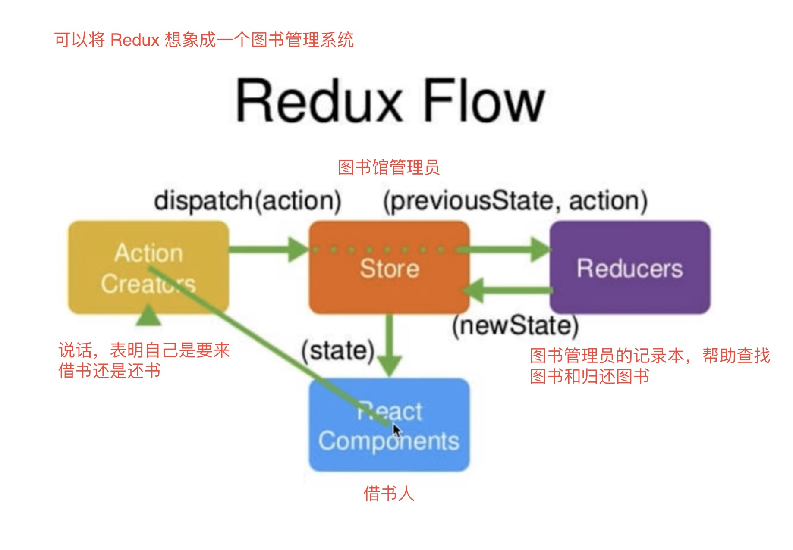
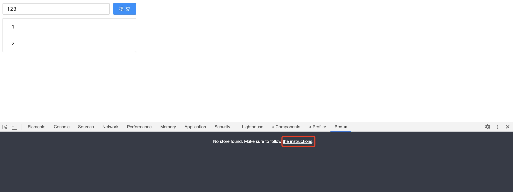
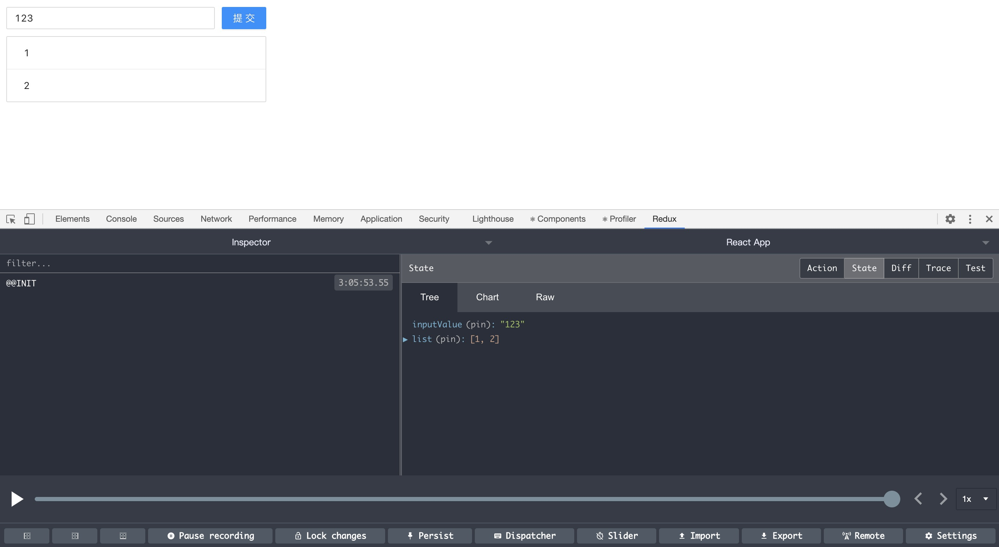
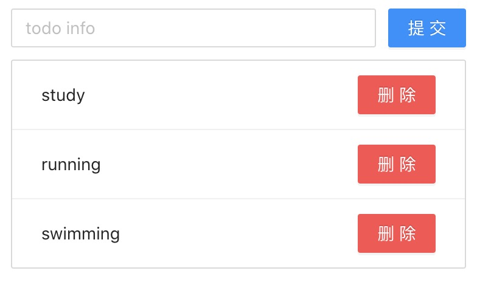
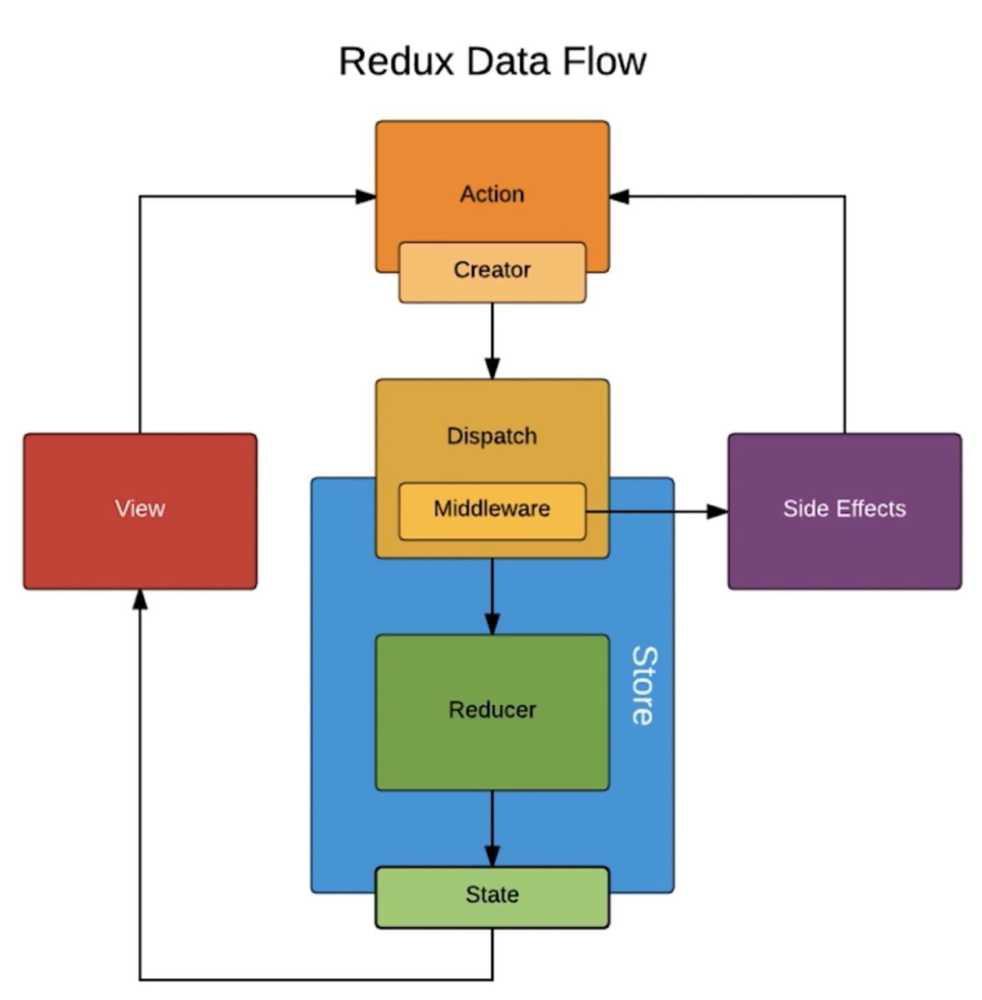

## Redux 简介

- Redux = Reducer + Flux

- [Redux 官网](https://redux.js.org/)

## Redux 的工作流程



## antd 的使用

[antd](https://ant.design/docs/react/introduce-cn) 是基于 Ant Design 设计体系的 React UI 组件库，主要用于研发企业级中后台产品。

## Redux DevTools

- 可以在 Chorme 网上应用商店里搜索添加这个插件帮助调试 Redux。

- 默认是不显示插件面板的，如下。点击 [the instructions](https://github.com/zalmoxisus/redux-devtools-extension#usage) 就会跳转到插件的使用文档。



我们需要在代码中创建 store 的时候传入第二个参数，才会在浏览器中显示插件面板。

```js
const store = createStore(
  reducer,
  window.__REDUX_DEVTOOLS_EXTENSION__ && window.__REDUX_DEVTOOLS_EXTENSION__()
);
```



## Redux 设计和使用的三项原则

- store 是唯一的。

- 只有 store 能够改变自己的内容。

- Reducer 必须是纯函数。

## Redux 核心 API

- createStore

- store.dispatch()

- store.getState()

- store.subscribe()

## Redux 小实战

下面是使用 antd 和 Redux 实现的 todolist 功能。完整代码如下：

### TodoList.js

```jsx
/*
 * TodoList.js
 */

import React, { Component } from "react";
import "antd/dist/antd.css";
import { Input, Button, List } from "antd";
import store from "../../store";
// import { CHANGE_INPUT_VALUE, ADD_TODO_ITEM, DELETE_TODO_ITEM } from '../../store/actionTypes';
import {
  getInputChangeAction,
  getAddItemAction,
  getDeleteItemAction,
} from "../../store/actionCreators";

class TodoList extends Component {
  constructor(props) {
    super(props);
    this.state = store.getState(); // 获取 store 里的数据
    // console.log(store.getState());
    this.handleInputChange = this.handleInputChange.bind(this);
    this.handleStoreChange = this.handleStoreChange.bind(this);
    this.handleBtnClick = this.handleBtnClick.bind(this);
    store.subscribe(this.handleStoreChange); // 订阅，当 store 发生变化的时候，就会执行里面的函数
  }

  render() {
    return (
      <div style={{ marginTop: "10px", marginLeft: "10px" }}>
        <div>
          <Input
            value={this.state.inputValue}
            placeholder="todo info"
            style={{ width: "300px", marginRight: "10px" }}
            onChange={this.handleInputChange}
          />
          <Button type="primary" onClick={this.handleBtnClick}>
            提交
          </Button>
          <List
            style={{ marginTop: "10px", width: "374px" }}
            bordered
            dataSource={this.state.list}
            renderItem={(item, index) => (
              <List.Item>
                <span>{item}</span>
                <Button
                  type="primary"
                  danger
                  onClick={this.handleDelete.bind(this, index)}
                >
                  删除
                </Button>
              </List.Item>
            )}
          />
        </div>
      </div>
    );
  }

  handleInputChange(e) {
    // const action = {
    // 	type: CHANGE_INPUT_VALUE,
    // 	value: e.target.value
    // }
    const action = getInputChangeAction(e.target.value);
    store.dispatch(action);
  }

  handleStoreChange() {
    // console.log('store change');
    this.setState(store.getState());
  }

  handleBtnClick() {
    // const action = {
    // 	type: ADD_TODO_ITEM
    // }
    const action = getAddItemAction();
    store.dispatch(action);
  }

  handleDelete(idx) {
    // const action = {
    // 	type: DELETE_TODO_ITEM,
    // 	index: idx
    // }
    const action = getDeleteItemAction(idx);
    store.dispatch(action);
  }
}

export default TodoList;
```

### index.js

```js
/*
 * /store/index.js
 */

import { createStore } from "redux";
import reducer from "./reducer";

// 创建 store 的时候把 reducer 传给它
const store = createStore(
  reducer,
  window.__REDUX_DEVTOOLS_EXTENSION__ && window.__REDUX_DEVTOOLS_EXTENSION__()
);

export default store;
```

### reducer.js

```js
/*
 * /store/reducer.js
 */

import {
  CHANGE_INPUT_VALUE,
  ADD_TODO_ITEM,
  DELETE_TODO_ITEM,
} from "./actionTypes";

const defaultState = {
  inputValue: "",
  list: [],
};

// reducer 可以接收 state，但是绝不能修改 state
// 所以我们需要把原来的 state 复制一份出来修改
// reducer 必须是个纯函数
// 纯函数是指，给定固定的输入，就一定会有固定的输出，而且不会有任何副作用
export default (state = defaultState, action) => {
  // console.log(state, action);
  if (action.type === CHANGE_INPUT_VALUE) {
    const newState = JSON.parse(JSON.stringify(state));
    newState.inputValue = action.value;
    return newState;
  }
  if (action.type === ADD_TODO_ITEM) {
    const newState = JSON.parse(JSON.stringify(state));
    newState.list.push(newState.inputValue);
    newState.inputValue = "";
    return newState;
  }
  if (action.type === DELETE_TODO_ITEM) {
    const newState = JSON.parse(JSON.stringify(state));
    newState.list.splice(action.index, 1);
    return newState;
  }
  return state;
};
```

### actionTypes.js

```js
/*
 * /store/actionTypes.js
 */

// 统一管理 action 变量
export const CHANGE_INPUT_VALUE = "change_input_value";
export const ADD_TODO_ITEM = "add_todo_item";
export const DELETE_TODO_ITEM = "delete_todo_item";
```

### actionCreators.js

```js
/*
 * /store/actionCreators.js
 */

// 通过 actionCreators 来统一派发 action

import {
  CHANGE_INPUT_VALUE,
  ADD_TODO_ITEM,
  DELETE_TODO_ITEM,
} from "./actionTypes";

export const getInputChangeAction = (value) => ({
  type: CHANGE_INPUT_VALUE,
  value,
});

export const getAddItemAction = () => ({
  type: ADD_TODO_ITEM,
});

export const getDeleteItemAction = (index) => ({
  type: DELETE_TODO_ITEM,
  index,
});
```

### 最终效果



## 容器组件和 UI 组件的拆分

- 容器组件又被称为聪明组件，因为容器组件并不管页面最后长什么样，它关注的是整个组件的业务逻辑，主要负责整个组件的功能实现。

- UI 组件又被称为傻瓜组件，它只负责页面的渲染展示，没有任何业务逻辑可言。

- 可以把上面做好的 todolist 组件拆成容器组件 TodoList 和 UI 组件 TodoListUI，如下：

```js
/*
 * TodoList.js
 */

import React, { Component } from "react";
import "antd/dist/antd.css";
import store from "../../store";
import {
  getInputChangeAction,
  getAddItemAction,
  getDeleteItemAction,
} from "../../store/actionCreators";
import TodoListUI from "./TodoListUI";

class TodoList extends Component {
  constructor(props) {
    super(props);
    this.state = store.getState(); // 获取 store 里的数据
    this.handleInputChange = this.handleInputChange.bind(this);
    this.handleStoreChange = this.handleStoreChange.bind(this);
    this.handleBtnClick = this.handleBtnClick.bind(this);
    this.handleDelete = this.handleDelete.bind(this);
    store.subscribe(this.handleStoreChange); // 订阅，当 store 发生变化的时候，就会执行里面的函数
  }

  render() {
    return (
      <TodoListUI
        inputValue={this.state.inputValue}
        list={this.state.list}
        handleInputChange={this.handleInputChange}
        handleBtnClick={this.handleBtnClick}
        handleDelete={this.handleDelete}
      />
    );
  }

  handleInputChange(e) {
    const action = getInputChangeAction(e.target.value);
    store.dispatch(action);
  }

  handleStoreChange() {
    this.setState(store.getState());
  }

  handleBtnClick() {
    const action = getAddItemAction();
    store.dispatch(action);
  }

  handleDelete(idx) {
    const action = getDeleteItemAction(idx);
    store.dispatch(action);
  }
}

export default TodoList;
```

```jsx
/*
 * TodoListUI.js
 */

// UI 组件，只负责渲染

import React, { Component } from "react";
import { Input, Button, List } from "antd";

class TodoListUI extends Component {
  render() {
    return (
      <div style={{ marginTop: "10px", marginLeft: "10px" }}>
        <div>
          <Input
            value={this.props.inputValue}
            placeholder="todo info"
            style={{ width: "300px", marginRight: "10px" }}
            onChange={this.props.handleInputChange}
          />
          <Button type="primary" onClick={this.props.handleBtnClick}>
            提交
          </Button>
          <List
            style={{ marginTop: "10px", width: "374px" }}
            bordered
            dataSource={this.props.list}
            renderItem={(item, index) => (
              <List.Item>
                <span>{item}</span>
                <Button
                  type="primary"
                  danger
                  onClick={() => {
                    this.props.handleDelete(index);
                  }}
                >
                  删除
                </Button>
              </List.Item>
            )}
          />
        </div>
      </div>
    );
  }
}

export default TodoListUI;
```

## 无状态组件

- 当一个组件只有一个 render 函数的时候，我们就可以把它改写成一个无状态组件，相对于普通组件来说性能比较高。这是因为无状态组件就是一个函数，普通组件会有各种生命周期要执行，性能肯定没法跟无状态组件相比。

- 将上面的 UI 组件 TodoListUI 改写成无状态组件如下：

```jsx
import React from "react";
import { Input, Button, List } from "antd";

const TodoListUI = (props) => {
  return (
    <div style={{ marginTop: "10px", marginLeft: "10px" }}>
      <div>
        <Input
          value={props.inputValue}
          placeholder="todo info"
          style={{ width: "300px", marginRight: "10px" }}
          onChange={props.handleInputChange}
        />
        <Button type="primary" onClick={props.handleBtnClick}>
          提交
        </Button>
        <List
          style={{ marginTop: "10px", width: "374px" }}
          bordered
          dataSource={props.list}
          renderItem={(item, index) => (
            <List.Item>
              <span>{item}</span>
              <Button
                type="primary"
                danger
                onClick={() => {
                  props.handleDelete(index);
                }}
              >
                删除
              </Button>
            </List.Item>
          )}
        />
      </div>
    </div>
  );
};
```

## Redux 发送异步请求

### axios

- 可以直接使用 axios 发送请求，发送方法跟之前在 React 里面发送数据是一样的，只不过拿到数据后，更新到页面上需要用 Redux 的方式去更新。

```js
componentDidMount() {
	axios.get('/api/todolist')
		.then((res) => {
			const data = res.data.data;
			const action = initListAction(data);
			store.dispatch(action);
		})
		.catch(() => { console.log('fail')})
}
```

### Redux Thunk

[Redux Thunk](https://github.com/reduxjs/redux-thunk) 是 Redux 的一个中间件，能够帮助我们把异步请求放到 actionCreators 中统一管理。

**1. 和 Redux DevTools 一起使用**

Redux DevTools 其实也是 Redux 的一个中间件，所以可以和 Redux Thunk 一起使用，用法可以参考 Redux DevTools 的指南：[redux-devtools-extension](https://github.com/zalmoxisus/redux-devtools-extension#12-advanced-store-setup)。

```js
/*
 * /store/index.js
 */

import { createStore, applyMiddleware, compose } from "redux";
import thunk from "redux-thunk";
import reducer from "./reducer";

const composeEnhancers = window.__REDUX_DEVTOOLS_EXTENSION_COMPOSE__
  ? window.__REDUX_DEVTOOLS_EXTENSION_COMPOSE__({})
  : compose;
const enhancer = composeEnhancers(applyMiddleware(thunk));

// 创建 store 的时候把 reducer 传给它
const store = createStore(reducer, enhancer);

export default store;
```

**2. Redux Thunk 的用法**

之前当没有引入 Redux Thunk，action 只能返回一个对象；但是当我们引入了 Redux Thunk 之后，action 不仅能返回一个对象，还能返回一个函数，并且返回的函数还能接收到一个参数：`dispatch`，我们可以直接使用它来修改 store 里的数据。store 接收到这个函数之后会自动执行它。

```js
/*
 * TodoList.js
 */

import { getTodoList } from '../../store/actionCreators';

componentDidMount() {
	const action = getTodoList();
	store.dispatch(action);
}
```

```js
/*
 * /store/actionCreators.js
 */

import axios from "axios";
import { INIT_LIST } from "./actionTypes";

export const initListAction = (data) => ({
  type: INIT_LIST,
  data,
});

// 用了 Redux Thunk 之后，就可以把异步请求放到 action 中统一管理
export const getTodoList = () => {
  return (dispatch) => {
    axios
      .get("/api/todolist")
      .then((res) => {
        const data = res.data.data;
        const action = initListAction(data);
        dispatch(action);
      })
      .catch(() => {
        console.log("fail");
      });
  };
};
```

```js
/*
 * /store/actionTypes.js
 */

export const INIT_LIST = 'init_list';
```

```js
/*
 * /store/reducer.js
 */

import { INIT_LIST } from './actionTypes';

const defaultState = {
  inputValue: '',
  list: []
};

export default (state = defaultState, action) => {
  if (action.type === INIT_LIST) {
    const newState = JSON.parse(JSON.stringify(state));
    newState.list = action.data;
    return newState;
  }
  return state;
}
```

### redux-saga

[redux-saga](https://github.com/redux-saga/redux-saga) 是 Redux 的另一个常用中间件，它会把异步请求统一放到 `sagas.js` 文件中进行管理。sagas.js 文件返回的是一个 generator 函数。

**1. 和 Redux DevTools 一起使用**

引入方法跟 Redux Thunk 类似，不过需要先建好一个 sagas.js 文件，并在创建 store 之后使用它。

```js
/*
 * /store/index.js
 */

import { createStore, applyMiddleware, compose } from "redux";
import createSagaMiddleware from "redux-saga";
import todoSagas from "./sagas";
import reducer from "./reducer";

const sagaMiddleware = createSagaMiddleware();

const composeEnhancers = window.__REDUX_DEVTOOLS_EXTENSION_COMPOSE__
  ? window.__REDUX_DEVTOOLS_EXTENSION_COMPOSE__({})
  : compose;
const enhancer = composeEnhancers(applyMiddleware(sagaMiddleware));

// 创建 store 的时候把 reducer 传给它
const store = createStore(reducer, enhancer);

sagaMiddleware.run(todoSagas);

export default store;
```

```js
/*
 * /store/sagas.js
 */

// 返回一个 generator 函数
function* todoSagas() {}

export default todoSagas;
```

**2. redux-saga 的用法**

redux-saga 有很多 api，所以，它的使用也要比 Redux Thunk 复杂的多。

之前 action 只能被 reducer 接收，使用了 redux-saga 之后，action 也能在 sagas.js 文件中被接收到。

```js
/*
 * TodoList.js
 */

import { getInitList } from '../../store/actionCreators';

componentDidMount() {
	const action = getInitList();
	store.dispatch(action);
}
```

```js
/*
 * /store/actionCreators.js
 */

import { GET_INIT_LIST } from './actionTypes';

export const getInitList = () => ({
  type: GET_INIT_LIST
})
```

```js
/*
 * /store/actionTypes.js
 */

export const GET_INIT_LIST = 'get_init_list';
```

```js
/*
 * /store/sagas.js
 */

import { put, takeEvery } from "redux-saga/effects";
import { GET_INIT_LIST } from "./actionTypes.js";
import { initListAction } from "./actionCreators";
import axios from "axios";

function* getInitList() {
  // generator 函数要捕获错误时，需要用 try ... catch
  try {
    const res = yield axios.get("/api/todolist");
    const action = initListAction(res.data.data);
    yield put(action);
  } catch {
    console.log("请求失败");
  }
}

function* todoSagas() {
  yield takeEvery(GET_INIT_LIST, getInitList);
}

export default todoSagas;
```

## Redux 中间件

- 所谓的中间件，就是指在 action 和 store 中间，只有 Redux 才有 action 和 store，所以中间件指的是 Redux 的中间件。

- Redux 常见的中间件有 [Redux Thunk](https://github.com/reduxjs/redux-thunk)、[redux-saga](https://github.com/redux-saga/redux-saga)。




## React Redux

[React Redux](https://github.com/reduxjs/react-redux) 是一个第三方库，能够帮助我们在 React 中更方便的使用 Redux。

### Provider

Provider 的作用就是把 store 提供给了它所包含的所有组件，使得它们都可以使用。

```jsx
import { Provider } from "react-redux";
import store from './store';

const App = (
  // Provider 把 store 提供给了它所包含的所有组件，它们都可以使用
  <Provider store={store}>
    <TodoList />
  </Provider>
)

ReactDOM.render(
  App,
  document.getElementById("root"),
  () => {
    console.log("Render successful!");
  }
);
```

### connect

connect 方法是让组件和 store 做连接。

```js
// connect 方法是让 TodoList 和 store 做连接
// TodoList 是一个 UI 组件，当 connect 将它和 store 连接起来之后，返回的结果是一个容器组件
export default connect(mapStateToProps, mapDispatchToProps)(TodoList);
```

### mapStateToProps

mapStateToProps 的作用是将 store 里的数据映射到组件的 props，返回一个对象。

```js
// 将 store 里的数据映射到组件的 props
const mapStateToProps = (state) => {
  return {
    inputValue: state.inputValue
  }
}
```

### mapDispatchToProps

mapDispatchToProps 的作用是把 store.dispatch 方法挂载到组件的 props 上，也是返回一个对象。

```js
// 把 store.dispatch 方法挂载到组件的 props 上
const mapDispatchToProps = (dispatch) => {
  return {
    handleInputChange(e) {
      const action = {
        type: 'change_input_value',
        value: e.target.value
      }
      dispatch(action);
    }
  }
}
```